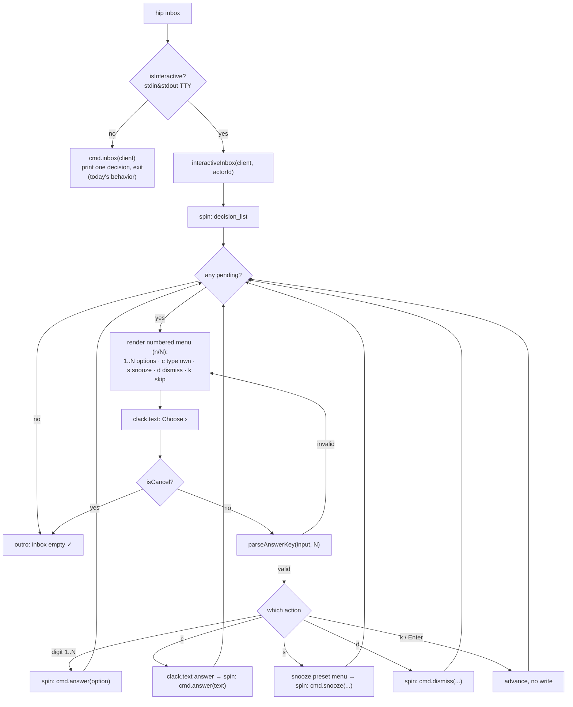

# feat: Interactive clack-powered CLI for HIP

## Summary

Make the `hip` CLI feel like a polished interactive app instead of a print-and-exit
script. The headline fix: `hip inbox` currently renders **one** decision as text and
returns to the shell — which reads as "the CLI closed on me." Replace that with a
**stay-open interactive loop** built on [`@clack/prompts`](https://www.npmjs.com/package/@clack/prompts):
the user walks each pending decision, picks an answer (option / free text / snooze /
dismiss / skip), sees a spinner while the daemon call runs, and advances to the next
decision until the inbox is empty — all without leaving the program. **Every answer is
number-keyed** (`1`, `2`, `3`… for options; `c` for type-my-own free text; `s` snooze, `d`
dismiss, `k` skip) — arrow-scrolling is never the only way to answer. Layer in spinners
on slow daemon round-trips and `picocolors` styling on the read commands (`list`, `show`,
`status`, `demo`).

```
$ hip inbox
◆  Inbox · 3 waiting on you
│
◇  (1/3) Reply to landlord — lease renewal
│  Renew for 12 or 24 months?
│
│   1) 12 months      2) 24 months
│   c) ✎ type your own    s) ⏰ snooze    d) ✕ dismiss    k) → skip
│
◆  Choose › 2
└  ✓ Answered "24 months" → next decision…
```

Interactivity is **TTY-gated**: when stdout/stdin is not a terminal (pipes, CI, the
existing vitest suite that calls the command bodies directly), the CLI falls back to
today's exact plain-string output, so scripting and tests are unaffected.

---

## Problem Frame

The CLI dogfoods the MCP binding well, but the UX is bare:

- **`hip inbox` exits after one decision.** `commands.ts:inbox()` returns the first
  decision rendered as a string; the process then ends. To answer it the user must
  read the printed `hip answer <id> --option <id>` hint, retype a second command, and
  re-run. With several pending decisions this is many context switches. It feels like
  the tool "closed out" rather than walking them through their inbox.
- **No progress feedback.** `client.connect()` and each tool call are awaited silently;
  on a cold daemon or a slow op the terminal just hangs with no spinner.
- **Flat, monochrome output.** `list` / `show` / `status` print uncolored text. Status,
  priority, and "waiting on…" states don't pop.

The user pointed at `@clack/prompts` (named resource — authoritative) and explicitly
asked for `hip inbox` to "stay in and interactive." Scope confirmed as **interactive
inbox + polish** (not a full bare-`hip` TUI menu — that is deferred).

---

## Requirements

| ID | Requirement |
|----|-------------|
| R1 | `hip inbox` in a TTY opens an interactive loop that walks every pending decision and stays open until the inbox is empty or the user quits. |
| R2 | Each decision offers, in one styled select: each option, "type my own" (free text), snooze, dismiss, and skip-for-now. |
| R3 | The chosen action calls the **same** MCP command bodies used today (`answer`/`snooze`/`dismiss`), preserving escalation→reconcile steering. |
| R4 | Ctrl-C / clack-cancel at any prompt exits cleanly: the MCP client closes, no partial write, friendly outro. |
| R5 | A spinner wraps slow daemon work (client connect + each tool call) with success/fail framing. |
| R6 | `list`, `show`, `status`, `demo` gain `picocolors` styling and clack `note`/`box` framing where it improves scannability. |
| R7 | When not a TTY (piped, redirected, CI, vitest direct calls), every command falls back to today's plain-string output — no prompts, no ANSI escapes that would corrupt captured output. |
| R8 | Existing flag-driven subcommands (`hip answer <id> --option`, `--text`, `hip snooze`, `hip dismiss`) keep working unchanged for scripting. |
| R9 | The existing vitest suite (which calls `commands.ts` bodies directly) stays green without modification. |
| R10 | **Every selectable answer has a number shortcut** (press `1`, `2`, `3`… to choose an option). Numbers always work; arrow-key navigation is never the *only* way to answer. |
| R11 | Reserved letter shortcuts are consistent across prompts: **`c` = type my own (free text)** — labeled "type your own", not "chat", since it is a one-shot answer, `s` = snooze, `d` = dismiss, `k` or `Enter` = skip. Confirm prompts take `1`/`y` = yes, `2`/`n` = no. |
| R12 | `hip demo` seeds **one believable, specific example per distinct HIP scenario** (options decision, free-text decision, proximity/context nudge, waiting+cadence, inbound reconcile-attach, escalation, snoozed decision, priority + plain tasks) so a first-timer sees the full range immediately, and its summary ends with the explicit next step: `Now run: hip inbox`. |
| R13 | Snooze never asks for a raw ISO timestamp. The snooze prompt is a numbered preset menu (`1` this evening, `2` tomorrow morning, `3` this weekend, `4` next week, `5` custom…); custom accepts shorthand (`2h`, `3d`, `mon`) as well as ISO. The resolved date is echoed back (`✓ Snoozed until Mon Jun 16, 9am`). |
| R14 | A failed mutation (answer/snooze/dismiss rejected by the daemon) does **not** abort the loop: the error is shown and the same decision is re-prompted (user can retry or skip). Only the initial connect failure is fatal. |
| R15 | The loop shows a progress counter per decision (`(2/5) …`) and ends with a summary outro: counts of answered / snoozed / dismissed / skipped, plus a hint when skipped items remain (`2 still pending — run hip inbox again`). |

---

## High-Level Technical Design

Two presentation layers over one unchanged command core. The command bodies in
`src/cli/commands.ts` stay pure (client in → string out) and remain the non-TTY path
and the test seam. A new interactive layer wraps clack and drives the same bodies.



The inbox loop lives **inside** `withClient`, so the existing `finally { client.close() }`
guarantees R4 (clean close on cancel/exit). Each mutation arrow (`L`, `Q`, `M`, `N`) is
wrapped in a per-decision try/catch: on failure the error is rendered and control returns
to `H` (re-prompt the same decision) rather than tearing down the loop (R14).

---

## Key Technical Decisions

**KTD1 — `@clack/prompts@^1.5.1` + `picocolors@^1.1.1`.** Clack is pure ESM (the package's
`type` is `module`) — matches this project's `"type": "module"` / NodeNext config with no
interop friction. It is the resource the user named. `picocolors` is the smallest, fastest
ANSI color lib and auto-detects color support. Both are runtime `dependencies` (the CLI is
shipped, not a dev tool). Pin with caret at the current latest.

**KTD2 — TTY gate is the single source of "interactive?".** A `isInteractive()` helper
returns `Boolean(process.stdin.isTTY && process.stdout.isTTY)` and is also overridable to
`false` by `HIP_NO_INTERACTIVE=1` and by `--plain` (escape hatch for users/scripts). Every
interactive entry point checks it first and falls back to the plain renderer. This one gate
satisfies R7/R8/R9 — clack prompts would otherwise hang or throw on a non-TTY stdin.

**KTD3 — keep `commands.ts` pure; add a separate `interactive.ts`.** The command bodies
stay `(client, …) => Promise<string>`. The interactive layer is additive and imports them
for the actual mutations. This keeps the test seam intact (R9) and means the interactive
code is a thin presentation wrapper, not a fork of the logic.

**KTD4 — reuse command bodies for all mutations (no new write paths).** The select's chosen
action maps to `cmd.answer` / `cmd.snooze` / `cmd.dismiss`. Escalation decisions already
route through reconcile inside `cmd.answer`, so interactive answers inherit that for free
(R3).

**KTD5 — a `spin(label, fn)` wrapper around async daemon work.** Wraps `clack.spinner()`
start/stop with success and error framing; in non-TTY it just awaits `fn` silently. Used
for connect and each tool call (R5).

**KTD6 — cancel handling via clack `isCancel`.** Every prompt result is checked with
`isCancel()`; on cancel the loop breaks to a friendly `outro` and returns, letting
`withClient`'s `finally` close the client (R4). No raw SIGINT handler needed for the happy
path.

**KTD7 — number-keyed prompt, not an arrow-only select (R10, R11).** Clack's `select` is
arrow-driven and exposes no number hotkeys, which conflicts with "numbers always, arrows not
required." So the answer prompt is a **rendered numbered menu** (`clack.note` or inline lines)
followed by a single `clack.text` prompt labeled **`Choose ›`** that accepts: a digit string
`1..N` for the options, `c` for type-my-own free text, `s` snooze, `d` dismiss, `k`/empty-Enter
skip. The prompt **submits on Enter** (that is how `clack.text` works) — we deliberately do *not*
use raw single-keypress input: Enter gives the user a chance to edit a mistyped key before it
commits an answer back to a waiting agent, and it makes **multi-digit options** (`10`, `12`)
unambiguous. The label is "Choose", not "press a key", so the UI never lies about needing Enter.
A pure `parseAnswerKey(input, optionCount)` function validates and maps the input (including
multi-digit numbers) to an action; invalid input re-prompts with a hint. This makes numbers the
primary, always-available path; arrow navigation is simply not part of the flow. The same numbered
convention is applied to confirms (`1`/`y` yes, `2`/`n` no). Legend is always shown so shortcuts
are discoverable. (If a richer highlighted list is wanted later, `@clack/core`'s `SelectPrompt`
can be subclassed to add number keybindings — deferred; the text prompt fully satisfies R10/R11 now.)

**KTD8 — snooze presets, never raw ISO entry (R13).** Asking a human to type an ISO timestamp
mid-inbox is the worst moment in the flow. The `s` action opens a second numbered menu — `1` this
evening, `2` tomorrow morning, `3` this weekend, `4` next week, `5` custom… — and only the custom
branch takes typed input, accepting shorthand (`2h`, `3d`, `mon`) or ISO. A pure
`parseSnoozeShorthand(input, now)` maps presets/shorthand to a concrete timestamp and is
unit-tested like `parseAnswerKey`. The resolved date is always echoed back
(`✓ Snoozed until Mon Jun 16, 9am`) so the user sees what actually got committed, not what they typed.

**KTD9 — per-decision error containment (R14).** `spin` rethrows so `withClient`'s connect-error
mapping still works, but inside the loop each mutation is wrapped in try/catch: a daemon error on
decision 2 of 5 renders an error line and re-prompts the *same* decision (retry or skip) instead of
aborting the session — an abort would reproduce the exact "the CLI closed on me" feel this plan
exists to fix. Only the initial connect failure is fatal (nothing works without it).

---

## Output Structure

New and changed files under `src/cli/`:

```
src/cli/
  tty.ts          # NEW  isInteractive(), spin(), color helpers, symbols
  interactive.ts  # NEW  interactiveInbox() loop + action mapping
  inbox.ts        # MOD  inbox command branches: interactive vs plain
  commands.ts     # MOD  read renderers gain TTY-gated color (string output unchanged in non-TTY)
  lifecycle.ts    # MOD  spin() around install build steps / status connect
  demo.ts         # MOD  spin() + styled summary (U3/U4); rewritten scenario set (U6)
  run.ts          # MOD  spin() around client.connect()
```

---

## Implementation Units

### U1. CLI presentation foundation (TTY gate, spinner, color)

**Goal:** Add the dependencies and a small shared module every other unit builds on.

**Requirements:** R5, R7, KTD1, KTD2, KTD5.

**Dependencies:** none.

**Files:**
- `package.json` (add `@clack/prompts`, `picocolors` to `dependencies`)
- `src/cli/tty.ts` (create)
- `test/tty.test.ts` (create)

**Approach:**
- `isInteractive(): boolean` → `Boolean(process.stdin.isTTY && process.stdout.isTTY)` unless
  `process.env.HIP_NO_INTERACTIVE` is set or a module-level `plain` flag was forced (set by a
  global `--plain` option parsed in `index.ts`).
- `spin<T>(label, fn): Promise<T>` → in interactive mode, start a `clack.spinner()`, await
  `fn`, stop with a success message; on throw, stop with an error message and rethrow. In
  non-interactive mode, just `await fn()`.
- Color helpers: thin wrappers over `picocolors` for status (`open`/`waiting`/`done`/`dropped`),
  priority, ids, and headings — each a no-op passthrough when `!isInteractive()` (belt-and-suspenders;
  picocolors already strips when no TTY, but explicit gating keeps captured output clean for R7).
- Export shared glyphs (waiting ⏳, done ✓, etc.) used by renderers.

**Patterns to follow:** module style of `src/cli/config.ts` (small, focused, pure functions).

**Test scenarios:**
- `isInteractive()` returns `false` when `process.stdout.isTTY` is undefined (simulated piped run). *(Covers R7.)*
- `isInteractive()` returns `false` when `HIP_NO_INTERACTIVE=1` even if TTY flags are forced true.
- `spin()` in non-interactive mode resolves to the wrapped value and writes nothing to stdout.
- `spin()` rethrows when the wrapped fn rejects (and still stops the spinner — assert no throw-swallow).
- color helper returns the raw input unchanged when non-interactive (no ANSI bytes in output).

---

### U2. Interactive inbox loop

**Goal:** Make `hip inbox` stay open and walk every pending decision — the core fix.

**Requirements:** R1, R2, R3, R4, R6 (note framing), R13, R14, R15, KTD3, KTD4, KTD6, KTD8, KTD9.

**Dependencies:** U1.

**Files:**
- `src/cli/interactive.ts` (create)
- `src/cli/inbox.ts` (modify — branch the `inbox` command on `isInteractive()`)
- `test/interactive.test.ts` (create)

**Approach:**
- `interactiveInbox(client, actorId): Promise<void>` runs inside `withClient`:
  1. `clack.intro` banner.
  2. `spin("Loading inbox", () => decision_list)`.
  3. Loop the decisions array. For each: `clack.note(task title + prompt)` with a progress
     counter in the title (`(2/5) Reply to landlord…`, R15), then render a **numbered legend** —
     each option as `1`, `2`, `3`…, plus `c type your own · s snooze · d dismiss · k skip` — and a
     single `clack.text("Choose ›")` prompt (R10/R11; submits on Enter per KTD7).
  4. `parseAnswerKey(input, optionCount)` maps the input (multi-digit OK) to an action; on invalid
     input, re-render the legend with a hint and re-prompt. Map the action to the matching command
     body via `spin`, each call wrapped in try/catch — on failure, render the error and re-prompt
     the same decision (KTD9, R14):
     - digit `1..N` → `cmd.answer(client, actorId, id, { option })` (Nth option's id)
     - `c` → `clack.text("Your answer")` → `cmd.answer(…, { text })`
     - `s` → numbered preset menu (`1` this evening … `5` custom) → `parseSnoozeShorthand` →
       `cmd.snooze(…)`; echo the resolved date (`✓ Snoozed until Mon Jun 16, 9am`) (KTD8, R13)
     - `d` → `clack.confirm("Dismiss?")` (also number-keyed `1`/`2`) → `cmd.dismiss(…)`
     - `k` / empty Enter → continue, no write
  5. `isCancel()` on any prompt → break to `clack.outro` and return.
  6. After the loop (or empty list) → summary outro (R15): `Inbox clear ✓ — answered 2 · snoozed 1
     · skipped 2` and, when skips remain, `2 still pending — run hip inbox again`. Tally counts in
     plain loop variables.
- Extract **pure** `decisionToChoices(decision)` (numbered option list + which letters are active),
  `parseAnswerKey(input, optionCount)`, and `parseSnoozeShorthand(input, now)` so keystroke and
  snooze mapping are unit-testable without a live clack TTY.
- `inbox.ts`: `if (isInteractive()) await withClient((c, cfg) => interactiveInbox(c, cfg.actorId).then(() => "")); else await withClient((c) => cmd.inbox(c));`
  (the interactive path prints via clack and returns an empty string so `withClient`'s trailing
  `\n` write is harmless — or have interactive path manage its own output and skip the print).

**Technical design (directional):**
```
// "Renew for 12 or 24 months?"  options=[m12, m24]
// legend:  1) 12 months   2) 24 months   ·  c chat  s snooze  d dismiss  k skip
parseAnswerKey("1", 2)  -> { kind: "option", index: 0 }   // → option id m12
parseAnswerKey("2", 2)  -> { kind: "option", index: 1 }   // → option id m24
parseAnswerKey("c", 2)  -> { kind: "freeText" }
parseAnswerKey("s", 2)  -> { kind: "snooze" }
parseAnswerKey("d", 2)  -> { kind: "dismiss" }
parseAnswerKey("", 2)   -> { kind: "skip" }                // empty Enter
parseAnswerKey("k", 2)  -> { kind: "skip" }
parseAnswerKey("9", 2)  -> { kind: "invalid" }             // out of range → re-prompt
parseAnswerKey("z", 2)  -> { kind: "invalid" }
parseAnswerKey("12", 14) -> { kind: "option", index: 11 }  // multi-digit, submits on Enter

// snooze presets / shorthand (now = 2026-06-12T20:00 local)
parseSnoozeShorthand("2", now)   -> tomorrow 09:00         // preset: tomorrow morning
parseSnoozeShorthand("2h", now)  -> now + 2 hours          // custom shorthand
parseSnoozeShorthand("mon", now) -> next Monday 09:00
parseSnoozeShorthand("2026-07-01", now) -> that date       // ISO still accepted
parseSnoozeShorthand("yesterday", now)  -> invalid → re-prompt
```

**Patterns to follow:** `src/cli/commands.ts` `answer()` already encodes the option/text/escalation
branching — interactive layer should call it, not re-implement it.

**Test scenarios:**
- `parseAnswerKey` maps digits `1..N` to the right zero-based option index. *(Covers R10.)*
- `parseAnswerKey` maps `c`→freeText, `s`→snooze, `d`→dismiss, `k` and `""`→skip. *(Covers R11.)*
- `parseAnswerKey` returns `invalid` for an out-of-range digit (`"9"` with 2 options) and for an
  unmapped letter (`"z"`) — so the loop re-prompts rather than mis-answers. *(Covers R10.)*
- `parseAnswerKey` is case-insensitive (`"C"` == `"c"`) and handles multi-digit options
  (`"12"` with 14 options → index 11). *(Covers R10, KTD7.)*
- `parseSnoozeShorthand` maps presets (`"2"` → tomorrow 09:00), shorthand (`"2h"`, `"3d"`,
  `"mon"`), and ISO to concrete timestamps; past/garbage input → invalid. *(Covers R13.)*
- `decisionToChoices` numbers one entry per option and only marks the type-your-own key active
  when `allowFreeText` is true. *(Covers R2.)*
- Loop integration (driving the pure mapping against a seeded daemon, reusing `test/helpers.ts`
  like `cli.test.ts`): inputs `["1", "k", "d"]` over 3 decisions → `cmd.answer` called once for
  decision 1's first option, decision 2 untouched (skip), `cmd.dismiss` once for decision 3.
  *(Covers R1, R3, R10.)*
- Empty inbox → no command bodies called, outro path taken. *(Covers R1.)*
- A cancel sentinel mid-loop stops processing remaining decisions (no further writes). *(Covers R4.)*
- A mutation that rejects (stubbed `cmd.answer` throw) does not end the loop: the same decision is
  re-prompted and a subsequent retry/skip proceeds to the next decision. *(Covers R14.)*
- Summary tallies are correct for a mixed run (`answered 1 · snoozed 1 · skipped 1`) and the
  "still pending" hint appears iff skips remain. *(Covers R15.)*

---

### U3. Spinners on slow daemon paths

**Goal:** No silent hangs — connect and long ops show progress.

**Requirements:** R5.

**Dependencies:** U1.

**Files:**
- `src/cli/run.ts` (modify — wrap `client.connect()` in `spin`)
- `src/cli/lifecycle.ts` (modify — `status` connect, and `install`'s build/native steps if surfaced)
- `src/cli/demo.ts` (modify — `spin` around the seeding round-trips)

**Approach:** Wrap the awaited daemon work in `spin("Connecting to daemon", …)` etc. Keep the
existing actionable error messages (`run.ts` already maps connect failure to "run `hip serve`") —
`spin` rethrows so that mapping still fires. Non-TTY: silent, unchanged.

**Patterns to follow:** `src/cli/run.ts` `withClient` error mapping — do not swallow it.

**Test scenarios:**
- `withClient` still maps a connect failure to the "cannot reach the HIP daemon" message when
  wrapped in `spin` (spin rethrow path). *(Covers R5.)*
- Non-interactive run of a command produces byte-identical output to pre-change (golden check on
  one command, e.g. `list`). *(Covers R7.)*

---

### U4. Color + framing on read commands

**Goal:** `list`, `show`, `status`, `demo` read as a styled app in a terminal.

**Requirements:** R6, R7.

**Dependencies:** U1.

**Files:**
- `src/cli/commands.ts` (modify — `renderTaskLine`, `renderTaskView`, `renderDecision`)
- `src/cli/lifecycle.ts` (modify — `status` summary, `formatDoctor`)
- `src/cli/demo.ts` (modify — styled "what to try" summary)

**Approach:** Route status/priority/id/heading text through the U1 color helpers. Use clack `note`
for `show` blocks and the demo summary when interactive. Critically: every renderer must return the
**same plain string** when `!isInteractive()` — color helpers are pass-through there — so R7/R9 hold.

**Patterns to follow:** existing `renderTaskView` structure in `src/cli/commands.ts`; keep the line
shapes, only colorize tokens.

**Test scenarios:**
- `renderTaskLine` output contains no ANSI escape bytes when non-interactive. *(Covers R7.)*
- `renderTaskView` still contains the title, `from:`, references, thread, and executions sections
  (content unchanged; existing `cli.test.ts` "list and show render task state" stays green). *(Covers R9.)*
- A waiting task line includes the "waiting on …" text in both modes. *(Covers R6.)*

---

### U5. `--plain` global flag, docs, and manual smoke

**Goal:** Ship an escape hatch, document the new UX, and verify the real TTY experience.

**Requirements:** R7, R8.

**Dependencies:** U1, U2, U3, U4.

**Files:**
- `src/cli/index.ts` (modify — register a global `--plain` option that forces non-interactive)
- `README.md` (modify — show the interactive inbox, mention `--plain` / `HIP_NO_INTERACTIVE`,
  and note `NO_COLOR` is honored — picocolors respects it already, just document it)
- `docs/spec.md` or a short `docs/cli.md` (optional — note the CLI is a thin client either way)

**Approach:** Add `program.option("--plain", …)` and, in the pre-action hook, set the U1 force-plain
flag so subcommands fall back. Document that piping or `--plain` yields machine-readable output.
Manual smoke (not automated — needs a real TTY): run `hip demo` then `hip inbox`, answer one by
option, one by free text, snooze one, dismiss one, confirm the loop stays open and ends with the
outro; then `hip inbox --plain` to confirm fallback.

**Execution note:** U5's smoke is manual (clack needs a real TTY that vitest can't supply); the
automated guarantees live in U1–U4's non-TTY tests.

**Test scenarios:**
- `--plain` forces `isInteractive()` false for the duration of the command (assert via the U1 helper
  after the hook runs). *(Covers R7, R8.)*
- `Test expectation: none` for README/docs edits — prose only.

---

### U6. Enrich `hip demo` — one believable example per distinct HIP scenario

**Goal:** Replace the thin demo seed with a curated set that showcases **each distinct scenario HIP
handles**, using the most popular/relatable everyday examples (with specifics), so a first-timer
running `hip inbox` immediately understands what HIP is for. Includes proximity/context-triggered
items (e.g., "you're in the laundry room — move the wash to the dryer").

**Requirements:** R12 (demo covers each distinct HIP scenario with a relatable, specific example).

**Dependencies:** none (touches `hip demo` only; independent of U1–U5, composes with them visually).

**Files:**
- `src/cli/demo.ts` (modify — rewrite `seedDemo` scenario set)
- `test/cli.test.ts` (modify — extend the existing demo test for the new scenario coverage)

**Approach:** Seed one task/decision per scenario below through the MCP binding (same dogfood path).
Give every item a **specific, believable** title + description (names, dates, amounts, locations),
not generic stubs. Keep `seedDemo` idempotent (tolerate existing demo actors). Print a grouped
summary labeling which scenario each item demonstrates, and **end the summary with the explicit
next step: `Now run: hip inbox`** (R12) — the demo→inbox handoff is the whole first-run flow.
Order the seeding so the strongest examples (lease options, FedEx gate code) surface first in the
inbox loop. Seed a couple of demo actors (a teammate, a contractor, a delivery service) so
reconcile/waiting examples read naturally.

Distinct scenarios to cover (the demo's "menu of what HIP does"), each one relatable example:

| Scenario (HIP capability) | Relatable demo example |
|---|---|
| **Decision with options** (agent blocks → human picks → resume) | Landlord lease: "Renew for 12 or 24 months? Rent goes $2,400 → $2,520 (12mo) or holds at $2,400 (24mo)." |
| **Free-text decision** (open question) | Package delivery: "FedEx needs a gate code for the 3pm drop-off — what should I give them?" |
| **Proximity / context-triggered nudge** | Laundry: "You're in the laundry room — the washer finished 40 min ago. Move the load to the dryer?" |
| **Another context nudge** (errand-while-there) | Kitchen: "You're near the fridge — you flagged the milk expires today. Add milk to the grocery list?" |
| **Waiting on a person + auto-nudge cadence** | "Waiting on Alex to send Q3 revenue numbers for the board deck (nudges every 2 days)." |
| **Inbound message reconciles onto a task** (F2 attach) | Plumber task "Fix the dripping kitchen faucet" + an inbound text from the plumber — "Can do Thursday 9am" — attaches to its thread. |
| **Escalation steering** (unmatched inbound → where does it go?) | An inbound email "Re: your reservation" that doesn't match an open task → escalates: "File under Dinner with the Patels, or ignore?" |
| **Snoozed decision** (deferred, non-terminal) | "Renew your passport — expires in 5 months" snoozed until next month (shows the snoozed state). |
| **High-priority open task** | "Pay the electric bill — \$143, due tomorrow." (priority: high) |
| **Plain open task** | "Unpack the last two kitchen boxes from the move." |

**Patterns to follow:** the current `seedDemo` in `src/cli/demo.ts` (actor seeding, `blockedTask`,
`openTask`, idempotent `ensureActor`); extend it with a `reconcile_submit` helper for the
attach/escalation rows and a pre-`snooze` call for the snoozed row.

**Test scenarios:**
- After `seedDemo`, `decision_list` contains the options decision, the free-text decision, and the
  proximity decision (assert by prompt substrings). *(Covers R12.)*
- `task_list` includes the waiting task (`waiting on …`), the high-priority task, and the plain task.
- The plumber task's thread contains the reconciled inbound message after seeding (assert via
  `task_read` thread). *(Covers R12, exercises reconcile attach.)*
- The snoozed decision is present but not surfaced as the top inbox item (snoozed-until in the future).
- Re-running `seedDemo` does not throw on already-seeded demo actors (idempotency preserved).

---

## Scope Boundaries

**In scope:** interactive `hip inbox` loop; spinners on slow paths; color/framing on read commands;
`--plain` / `HIP_NO_INTERACTIVE` escape hatch; non-TTY fallback parity.

**Known asymmetry (accepted):** piped/`--plain` `hip inbox` keeps today's single-decision output
(R7 byte-parity) while the interactive loop walks all pending decisions. A multi-decision plain
listing is a possible follow-up, not part of this change.

### Deferred to Follow-Up Work
- **Bare `hip` interactive main menu** (arrow-select Inbox / Tasks / Waiting / Status). This was the
  "Full TUI overhaul" option; deferred by scope choice.
- **Interactive `list` / `show` pickers** (arrow-select a task → drill in). Read commands get color
  now, not navigation.
- **Interactive task creation wizard** (`hip new`). Task creation is currently an agent/MCP action;
  a human-facing creation flow is a separate feature.
- **Live-refreshing inbox** (re-poll while open). The loop walks a snapshot taken at entry.

### Non-Goals
- Changing any MCP tool, daemon, or store behavior. This is presentation-only over the existing
  binding.
- A full-screen TUI framework (Ink/blessed). Clack line-prompts are the chosen ceiling.

---

## Risks & Dependencies

| Risk | Mitigation |
|------|------------|
| Clack prompts hang or throw on a non-TTY stdin (CI, pipes, vitest). | KTD2 TTY gate short-circuits to plain renderers before any clack call; `test/tty.test.ts` asserts the gate. |
| ANSI escapes leak into piped/captured output and break scripts or tests. | Color helpers are pass-through when non-interactive; U3/U4 golden tests assert no ANSI bytes in non-TTY output. |
| Ctrl-C mid-loop strands the MCP client or a half-written decision. | Loop runs inside `withClient` (`finally` closes client); each mutation is a single atomic command-body call that either completes or isn't issued. |
| Existing `cli.test.ts` breaks because renderers changed. | KTD3 keeps `commands.ts` pure; renderers return identical strings in non-TTY; R9 is a verification gate. |
| New runtime deps bloat install. | Both are tiny (`picocolors` zero-dep; clack is small and already ESM). Net add is minor vs. the UX gain. |

**Dependencies:** `@clack/prompts@^1.5.1`, `picocolors@^1.1.1` (both runtime). No daemon or store
changes.

---

## Verification

- In a real terminal: `hip demo && hip inbox` walks the seeded decisions in one stay-open session
  (option answer, free-text answer, snooze via preset, dismiss), showing a `(n/N)` counter per
  decision and ending on a summary outro with tallies — never dropping back to the shell mid-inbox.
  Spinner shows on connect. Snooze echoes the resolved date, not the typed shorthand.
- Mid-loop daemon error (kill `hip serve` between decisions) shows an error and re-prompts the
  same decision instead of exiting the loop.
- `hip inbox | cat` (piped, non-TTY) prints today's single-decision plain output with no ANSI escapes.
- `hip inbox --plain` behaves like the piped case even in a TTY.
- `npm test` stays green with the existing `cli.test.ts` unmodified, plus the new U1/U2 tests.
- `npx eslint .` and `npm run build` clean.
