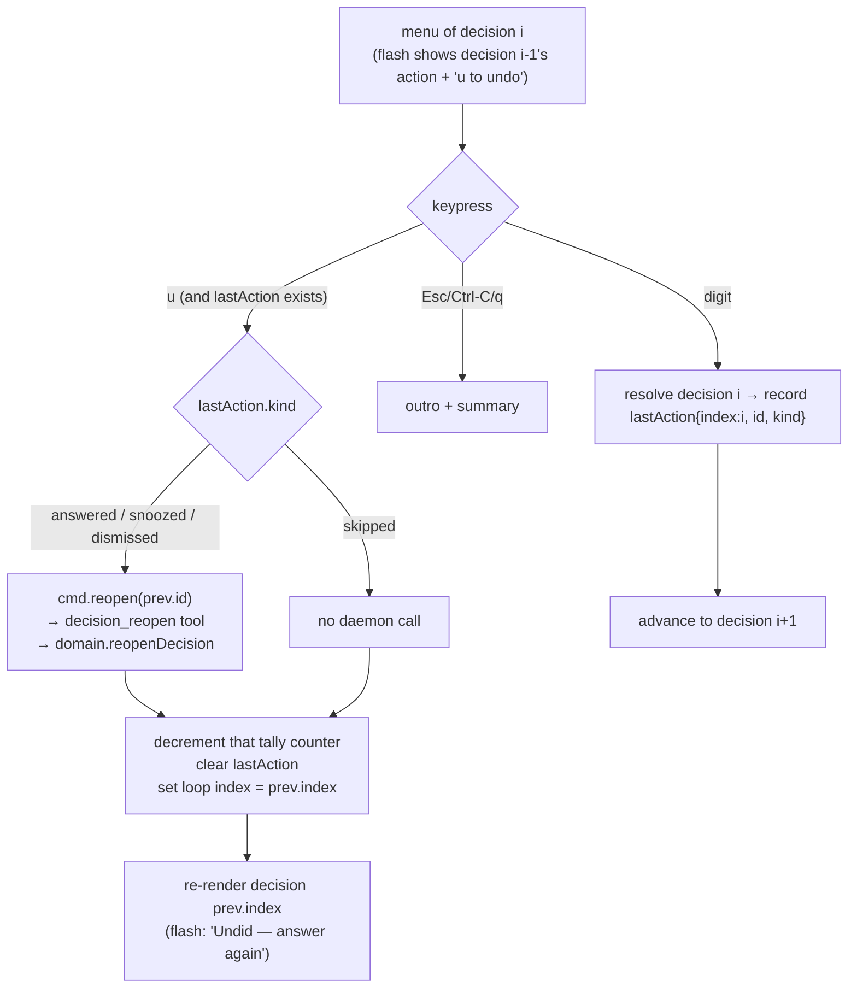

# feat: Undo for the interactive inbox

## Summary

Add an in-session **undo** to the interactive `hip inbox` TUI. After you answer, snooze,
or dismiss a decision and advance, the next decision's frame already flashes your last
action (`✓ Answered "12 months"`). This adds **`· press u to undo`** to that flash, and
pressing `u` **reopens** the previous decision and returns you to it to re-answer.

Undo is **single-level** (it reverses only the most recent action) and is a **real
daemon-level reopen**, not local UI state: because a resolution is terminal and resolving
*resumes the blocked agent execution*, undo must clear the resolution/snooze **and**
re-block that execution. This needs a new `decision_reopen` domain operation + MCP tool,
which is a genuine protocol capability (an agent or script can reopen a decision too), not
just a CLI affordance.

```
◆  HIP inbox (2/5)
│  ✓ Answered "12 months — rent rises to $2,520/mo"  ·  press u to undo
│
◇  Approve the dishwasher repair quote
│   1) Approve $340   2) Decline   3) Get a second quote
│   4) Type your own   5) Snooze   6) Dismiss   7) Skip
◆  Press a number · u to undo · Esc to quit
```

---

## Problem Frame

The inbox walks decisions one keypress at a time. A single keypress now **commits
instantly** (the plan's prior instant-submit change) — which is fast but unforgiving: a
fat-fingered `1` resolves the decision and resumes the waiting agent with the wrong
answer, and the user has no way back. The flash already *shows* what they just did; the
natural fix is to make that flash actionable.

The constraint that shapes everything: in `src/domain/decisions.ts`, `resolveDecision`
throws `conflict` on a resolved decision, and on resolve it flips the blocked execution
`input-required → working` (this is what resumes a `task_block`). So "undo" cannot be a
local re-prompt — the decision is genuinely resolved and the agent genuinely resumed. Undo
must reverse both: clear the resolution and put the execution back to `input-required`.

Confirmed design choices (solo planning):
- **Single-level** undo — `u` reverses the most recent action only; no back-stack.
- **Always undo, best-effort re-block** — reopen always succeeds; it re-blocks the single
  `working` execution on the task. If a real agent already consumed the answer, that is an
  accepted edge (HIP is local and human-paced).
- **All four actions** — answer / snooze / dismiss reopen the decision; skip just
  navigates back (nothing to reopen).

---

## Requirements

| ID | Requirement |
|----|-------------|
| R1 | A new `decision_reopen` operation clears a decision's resolution **and** `snoozedUntil`, returning it to the inbox (pending), and is a no-op on an already-open decision. |
| R2 | Reopening a decision that resumed an execution re-blocks that execution (`working → input-required`, `blockedOn` restored), best-effort: the single `working` execution on the decision's task. A task-less decision (standalone/nudge) reopens with no execution change. |
| R3 | `decision_reopen` is exposed as an MCP tool (parity with the other decision tools) so agents and scripts — not just the CLI — can reopen a decision. |
| R4 | In the interactive inbox, the flash for the just-completed decision shows `· press u to undo`, and the legend/footer advertises `u to undo`, **only when an undo target exists**. |
| R5 | Pressing `u` at the menu of the current decision reopens the previous decision (if its action mutated state) and returns the loop to that decision to re-answer. Undo is **single-level**: only the immediately-preceding action is reversible. |
| R6 | Undo reverses the tally for the undone action (answered/snoozed/dismissed/skipped counts) so the final summary stays correct. |
| R7 | Undo is suppressed for an **escalation answered by option** — `cmd.answer` routes those through `reconcile_resolve`, whose steering side-effects (created/attached task, `steered` event) reopen cannot cleanly reverse. All other actions (including snooze/dismiss/skip on an escalation) remain undoable. |
| R8 | Undo is a TTY-only TUI affordance. The non-interactive `cmd.inbox` path and the demo are unchanged; `u` is never consumed as input there. |

---

## High-Level Technical Design



`reopenDecision` is the inverse of `resolveDecision`: same load-mutate-write shape, but it
nulls `resolution`/`snoozedUntil` and, where `resolveDecision` cleared the execution block,
it restores it.

---

## Key Technical Decisions

**KTD1 — Real reopen at the domain layer, not UI-only.** Resolutions are terminal and
resume agents (`src/domain/decisions.ts:resolveDecision`). A UI-only "go back" would leave
the decision resolved and the agent running. So undo is built on a real `reopenDecision`
that mirrors `resolveDecision`'s structure (load via `store.loadDecision`, mutate, write via
`store.writeObjects` with an `extraDerive` for the execution). This keeps the file-layer and
SQLite-derived state consistent the same way resolve does.

**KTD2 — Best-effort execution re-block via `listExecutionsByTask`.** On resolve, the
resumed execution had its `blockedOn` cleared, so `store.getExecutionBlockedOn(id)` no longer
finds it. Reopen finds the execution to re-block with `store.listExecutionsByTask(d.task)` and
picks the single `status === "working"` one — the one resolve resumed. Set `blockedOn = id`,
`status = "input-required"`. If there is no task or no working execution (standalone decision,
or an already-completed agent), skip the re-block and just reopen the decision. This is the
"always undo, best-effort" choice — reopen never fails on a missing execution.

**KTD3 — Single-level undo tracked as one `lastAction` record in the TUI.** The loop keeps a
single `lastAction: { index, id, kind } | null`, set after every completed decision and
cleared after an undo. No back-stack. Pressing `u` is only offered when `lastAction !== null`
(which is exactly when a flash is showing). After undoing back to decision *k*, `lastAction`
is null until the user re-answers *k*, at which point `u` again reverses that. This matches
"takes you back to that question" without the state weight of a full history stack.

**KTD4 — Reopen is generic and idempotent; reuse existing event kinds.** `reopenDecision`
clears both `resolution` and `snoozedUntil` (one operation undoes either an answer/dismiss or
a snooze), is a no-op when the decision is already open, and emits events using existing
`HipEvent` kinds (`commented` for the reopen, `execution-updated` for the re-block) — no
`EventKind` enum change. The event payload (`{ reopened: true }`, `{ reblocked: true }`)
records intent for the audit log.

**KTD5 — Undo is a TTY affordance; the tool is universal.** The `u` keystroke and flash hint
live only in `src/cli/interactive.ts` (the TUI). The non-TTY `cmd.inbox` path never reads
keys, so it is untouched. But `decision_reopen` is registered as a normal MCP tool (R3), so
the capability is part of the protocol surface, not a CLI-private trick.

**KTD6 — Escalation-by-option is not undoable (R7).** `cmd.answer` sends an escalation's
option to `reconcile_resolve`, which creates/attaches a task and writes a `steered` event.
`reopenDecision` would clear the decision but not those side-effects, leaving an
inconsistent half-undo. So the TUI does not offer `u` after a steered escalation answer (it
records `lastAction = null` for that case). Snooze/dismiss/skip on an escalation are plain and
remain undoable.

---

## Implementation Units

### U1. `decision_reopen` domain operation

**Goal:** Add the inverse of `resolveDecision` — clear resolution/snooze and re-block the
resumed execution.

**Requirements:** R1, R2.

**Dependencies:** none.

**Files:**
- `src/domain/decisions.ts` (add `reopenDecision`)
- `src/domain/index.ts` (facade binding, alongside `resolveDecision`/`snoozeDecision`)
- `test/domain.test.ts` (reopen scenarios)

**Approach:**
- `reopenDecision(store, id, actorId): Decision`, mirroring `resolveDecision`'s
  load-mutate-write shape. Load with `store.loadDecision`; if the decision has neither
  `resolution` nor `snoozedUntil`, return it unchanged (no-op). Otherwise null both fields,
  bump `updatedAt`.
- Re-block: when the decision was resolved (not merely snoozed) and has a `task`, find the
  execution via `store.listExecutionsByTask(d.task)` with `status === "working"`; in an
  `extraDerive(db)` set `blockedOn = id`, `status = "input-required"`, `updatedAt`, and
  `store.upsertExecution`. Skip cleanly when no task or no working execution.
- Emit a `commented` event (`{ reopened: true }`) always, plus an `execution-updated` event
  (`{ execution, reblocked: true }`) when an execution was re-blocked. Reuse `decisionEvent`.

**Patterns to follow:** `resolveDecision` in `src/domain/decisions.ts` (the `extraDerive`
pattern for cross-object execution writes, `store.writeObjects` call shape); facade bindings
in `src/domain/index.ts`.

**Test scenarios:**
- Resolve a decision by option, then reopen → decision is pending again (`resolution` null) and
  appears in `listPendingDecisions`. *(R1)*
- A `task_block` decision: register + block an execution (input-required), resolve it (execution
  → working), reopen → that execution is back to `input-required` with `blockedOn` set to the
  decision id. *(R2)*
- Snooze a decision, then reopen → `snoozedUntil` is null and the decision is pending; no
  execution change asserted. *(R1)*
- Reopen an already-open (never-resolved) decision → no-op, no error, no spurious events. *(R1)*
- Reopen a resolved decision whose task has **no** working execution (e.g., execution completed)
  → decision reopens, no throw, no execution mutated. *(R2, best-effort)*
- Dismiss then reopen → pending again. *(R1)*

---

### U2. `decision_reopen` MCP tool

**Goal:** Expose reopen on the daemon so the CLI (and any agent/script) can call it.

**Requirements:** R3.

**Dependencies:** U1.

**Files:**
- `src/tools/decisions.ts` (register `decision_reopen`)
- `test/daemon.test.ts` (tool round-trip through a live `HipDaemon`/`HipClient`)

**Approach:** Register `decision_reopen` next to `decision_resolve`/`decision_snooze` with
`inputSchema { actorId, id }`, delegating to `domain.reopenDecision`. Use the existing
`guard`/`ok` result helpers. Description: "Undo: reopen a resolved or snoozed decision so it
returns to the inbox (re-blocks any resumed execution)."

**Patterns to follow:** the `decision_snooze` registration block in `src/tools/decisions.ts`
(same `{ actorId, id, ... }` shape, `guard(() => ok(...))`).

**Test scenarios:**
- Through the daemon: create + resolve a decision, call `decision_reopen`, then `decision_list`
  includes it again. *(R3)*
- `decision_reopen` on a missing id returns a tool error (not a crash). *(R3)*

---

### U3. CLI `reopen` body + TUI undo wiring

**Goal:** Wire `u`-to-undo into the inbox TUI on top of the existing flash mechanism.

**Requirements:** R4, R5, R6, R7, R8.

**Dependencies:** U2.

**Files:**
- `src/cli/commands.ts` (add `reopen(client, actorId, decisionId)`)
- `src/cli/interactive.ts` (undo handling in the loop, flash hint, footer legend, escalation
  suppression)
- `test/interactive.test.ts` (scripted-key undo scenarios)

**Approach:**
- `cmd.reopen` mirrors `cmd.dismiss`: `await client.callOk("decision_reopen", { actorId, id })`,
  returns a short confirmation string. Keeps the mutation logic out of the TUI (same seam as
  the other actions).
- Convert the loop's existing `for (let i …)` into an index-driven `while` so undo can move the
  index backward. Track `lastAction: { index, id, kind } | null` set whenever a decision
  completes; set it to `null` after a steered escalation answer (R7) and after an undo.
- Extend the selection read (`pickEntry`) to recognize `u`/`U` as an `undo` outcome **only when
  `lastAction !== null`** (so a stray `u` on the first decision is just an invalid key). For the
  >9-entry typed fallback, accept `"u"` likewise.
- On `undo`: if `lastAction.kind !== "skipped"`, `await cmd.reopen(client, actorId,
  lastAction.id)` (wrapped in the existing per-decision try/catch so a daemon error re-prompts
  rather than aborts). Decrement the matching tally counter (R6). Set the loop index to
  `lastAction.index`, clear `lastAction`, and set the flash to `Undid — answer again`.
- Flash + legend (R4): when `lastAction !== null`, append `· press u to undo` to the flash line
  and include `u to undo` in the footer hint. When it is null, neither appears.
- Non-TTY (R8): unchanged — `cmd.inbox` never enters this loop.

**Technical design (directional):**
```
// single-level undo, tracked as one record
let lastAction: { index, id, kind } | null = null
// after a completed decision i:
lastAction = isSteeredEscalation ? null : { index: i, id: d.id, kind }
// at the menu of decision i, pickEntry returns "undo" only if lastAction !== null
case "undo":
  if (lastAction.kind !== "skipped") await cmd.reopen(client, actorId, lastAction.id)
  tally[lastAction.kind]--          // reverse the count
  i = lastAction.index              // walk back
  flash = "Undid — answer again"; lastAction = null
```

**Patterns to follow:** the existing flash/`lastAction`-free loop in `src/cli/interactive.ts`
(the `flash` one-shot already renders atop the next frame); `cmd.dismiss` in
`src/cli/commands.ts`; the scripted-`InboxIO` test harness in `test/interactive.test.ts`.

**Test scenarios:**
- Answer decision 0 by option, then at decision 1 press `u` → `cmd.reopen` called for decision
  0's id; loop returns to decision 0; decision 0 is pending again (assert via the seeded daemon).
  *(R5)*
- Undo then re-answer with a different option → final resolution is the second option; tally
  shows one answered (not two). *(R5, R6)*
- `u` on the very first decision (no prior action) is treated as an invalid key — re-prompts,
  no reopen call. *(R5)*
- Undo a snooze → decision pending again, snoozed count back to 0. *(R6)*
- Undo a dismiss → decision pending again. *(R6)*
- Undo a skip → loop returns to that decision, **no** `decision_reopen` call made. *(R5)*
- After a steered escalation answer (escalation decision resolved by option), the next frame
  does **not** offer undo (`u` is an invalid key there). *(R7)*
- Summary tallies are correct across an answer-undo-reanswer sequence. *(R6)*

---

## Scope Boundaries

**In scope:** `decision_reopen` (domain + tool), `cmd.reopen`, single-level `u`-to-undo in the
inbox TUI, tally correctness, escalation-by-option suppression.

**Known edges (accepted):**
- **Agent-resume race** — if a real agent already consumed the answer before undo, reopen
  re-blocks the execution best-effort but cannot un-send what the agent did. Accepted: HIP is
  local and human-paced (KTD2).
- **Steered escalation answers are not undoable** (R7/KTD6) — their reconcile side-effects
  (created/attached task, `steered` event) are not reversed here.

### Deferred to Follow-Up Work
- **Multi-level undo / back-stack** — stepping back through the whole session. Deferred by the
  single-level choice; the `lastAction` record would become a stack.
- **Undo of reconcile steering** — reversing a `reconcile_resolve` (un-create / un-attach the
  task, retract the `steered` event) would make escalation-by-option undoable.
- **Redo** — re-applying an undone action. Not requested.

### Non-Goals
- No change to `resolveDecision`/`snoozeDecision` semantics; reopen is additive.
- No undo in the non-interactive/plain CLI path.

---

## Risks & Dependencies

| Risk | Mitigation |
|------|------------|
| Re-block picks the wrong execution when a task has several. | Filter to the single `status === "working"` execution (the one resolve resumed); if ambiguous/none, skip re-block — reopen still succeeds (KTD2). Covered by U1 tests. |
| Undo leaves file-layer and SQLite-derived state inconsistent. | Reuse `resolveDecision`'s exact `store.writeObjects` + `extraDerive` commit shape so the decision file and execution row update in one commit. |
| `u` collides with a future hotkey or is typed as a free-text answer. | `u` is only consumed at the **menu** read and only when `lastAction !== null`; free-text/custom-snooze use `readLine`, where `u` is ordinary text. |
| Escalation half-undo confuses users. | Suppress the undo affordance entirely for steered escalation answers (R7) rather than offering a partial undo. |

**Dependencies:** none external. Builds on the existing inbox TUI (`src/cli/interactive.ts`),
decision domain (`src/domain/decisions.ts`), and store execution lookups
(`store.listExecutionsByTask`, `store.getExecutionBlockedOn`, `store.upsertExecution`).

---

## Verification

- In a real terminal: `hip demo` → answer the lease by option → on the dishwasher frame the
  flash reads `✓ Answered … · press u to undo`; press `u` → returns to the lease, now pending;
  re-answer with the other option → only one answered in the final summary.
- Snooze a decision, `u` on the next frame → back to it, pending, snooze count reset.
- Skip a decision, `u` → back to it with no daemon error and no `decision_reopen` call.
- An escalation answered by option shows **no** undo hint on the next frame.
- `decision_reopen` works through the daemon for a non-CLI caller (assert in `test/daemon.test.ts`).
- `npm test` green (new U1/U2/U3 scenarios), `npx eslint .` and `npm run build` clean.
