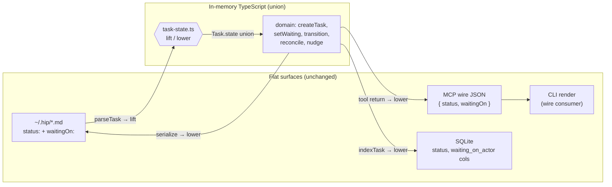

# refactor: Fold Task `status` + `waitingOn` into an internal discriminated union

## Summary

Today a `Task` carries both `status: TaskStatus` and `waitingOn: Waiting | null`, kept
in sync by the rule *"`waitingOn` present iff `status == "waiting"`"*. That invariant is
enforced by hand in four independent places. This refactor folds the two fields into one
discriminated union — `state: { kind: "waiting", … } | { kind: "open" } | { kind: "done" }
| { kind: "dropped" }` — so a waiting payload **cannot** exist without waiting state. Illegal
states become unrepresentable in TypeScript.

The union is **internal only**. Three external surfaces stay flat and unchanged:

- **On-disk YAML** keeps `status:` + `waitingOn:` keys (markdown is the human-editable truth).
- **MCP wire** keeps returning `{ status, waitingOn }` (the CLI dogfoods the binding and consumes the wire).
- **SQLite** keeps its scalar `status` + `waiting_on_actor` columns (derived cache; queries need flat values).

A single codec lifts flat→union on the way in (disk read) and lowers union→flat on the way
out (disk write, SQLite index, MCP tool returns). Because no external shape changes, **`docs/spec.md`
and `docs/binding.md` do not change**, existing `~/.hip` files round-trip untouched, and no
data migration is needed. The cost relocates entirely into: a two-type split (`Task` union vs.
`WireTask` flat DTO), one codec module, the internal read/write sites, and the test suite.

---

## Problem Frame

`src/types.ts` defines `Task.status` (enum) and `Task.waitingOn` (payload) as two fields encoding
one fact. The "present iff" invariant is currently re-asserted in four places:

1. **Domain write verbs** (`src/domain/tasks.ts`) — `createTask`, `setWaiting`, `transition` keep the pair in sync by hand.
2. **Indexer** (`src/store/indexer.ts`) — re-derives `waiting_on_actor` and the timer row from the pair.
3. **Reindex audit** (`src/store/reindex.ts`) — `wantsTimer = status === "waiting" && waitingOn?.cadence`.
4. **SQL** (`src/store/store.ts`) — `findWaitingTaskIdsByActor` hardcodes `WHERE status = 'waiting' AND waiting_on_actor = ?`.

Any future field added to the waiting payload, or any new transition, must be threaded through
all four by a developer who remembers the rule. The union collapses the in-memory enforcement to
the type system; the four sites instead read one discriminated value.

**Non-goal:** changing the protocol, the wire contract, the file format, or task behavior. This is a
representation refactor — same inputs, same outputs, same on-disk bytes.

---

## Key Technical Decisions

### KTD1 — Internal-only union; all external surfaces stay flat

The union is the in-memory canonical shape. Disk YAML, MCP wire JSON, and SQLite columns all stay
flat (`status` + `waitingOn` / `waiting_on_actor`). Rationale: keeps the human-editable markdown
readable (`status: waiting` rather than a nested `state:` block), keeps the agent-facing wire
contract stable, and avoids any spec rewrite or file migration. The type-safety win lands fully in
TypeScript regardless of boundary shape. *(Confirmed with user: "flat on disk, union in memory",
then "internal-only" for the wire.)*

### KTD2 — Two types: `Task` (internal union) and `WireTask` (flat boundary DTO)

`Task` becomes the rich internal union. `WireTask` is the flat DTO (essentially the *current* `Task`
shape) used at every boundary that leaves TypeScript — MCP tool returns, CLI wire consumption, and
the on-disk YAML projection. The CLI (`src/cli/commands.ts` and friends) is a **wire consumer** ("no
direct store access"), so it reads `WireTask`, not the union — its `t.status` / `t.waitingOn` reads
stay as-is, only the type annotation changes.

### KTD3 — `TaskStatus` survives as the shared discriminant

Keep `type TaskStatus = "open" | "waiting" | "done" | "dropped"`. It is reused as the union's `kind`
discriminant (`TaskState["kind"]` ≡ `TaskStatus`), as `WireTask.status`, as the `task_list` filter
enum, and as the SQLite `status` column value. One vocabulary, three surfaces.

### KTD4 — One codec module, called at four boundaries

A dedicated `src/store/task-state.ts` exports `liftTaskState(flat) → Task` and `lowerTaskState(Task)
→ WireTask`. Wired in at exactly four points: disk read (lift, in `deserialize`), disk write (lower,
in `serialize`), SQLite index (lower-then-read-columns, in `indexer.ts`), and MCP tool returns (lower,
in `tools/tasks.ts`). This is the single place the "two fields ↔ one union" mapping lives — replacing
the four hand-maintained invariant sites with one tested codec.

### KTD5 — Domain mutators set `state` wholesale, never field pairs

`setWaiting` / `transition` / `createTask` assign a complete `state` object (`t.state = { kind:
"waiting", … }`) instead of setting `status` and `waitingOn` separately. There is no longer a window
where the two disagree, even mid-mutation. A small read helper (`isTerminal(task)`) replaces the
`TERMINAL.includes(t.status)` checks.

---

## High-Level Technical Design

Data flow across the boundaries. The union exists only inside the dashed box; everything crossing a
boundary is flat.



*Directional — the union/flat type shapes are sketched in U1; exact field optionality and helper names are settled in implementation.*

---

## Implementation Units

### U1. Define the type split (`TaskState` union, internal `Task`, flat `WireTask`)

**Goal:** Establish the new type vocabulary so every downstream unit compiles against it.

**Requirements:** Foundation for KTD2, KTD3, KTD5.

**Dependencies:** none.

**Files:**
- `src/types.ts` (modify)

**Approach:**
- Keep `type TaskStatus = "open" | "waiting" | "done" | "dropped"`.
- Keep `interface Waiting { onActor; since; via?; cadence?; lastNudge?; _meta? }` — reused inside both the waiting variant and `WireTask`.
- Add the discriminated union:
  ```ts
  // directional
  type TaskState =
    | ({ kind: "waiting" } & Waiting)
    | { kind: "open" }
    | { kind: "done" }
    | { kind: "dropped" };
  ```
  (Whether the waiting variant intersects `Waiting` or inlines its fields is an implementation choice; the discriminant `kind` must equal `TaskStatus`.)
- Change `interface Task`: remove `status` and `waitingOn`; add `state: TaskState`. All other fields unchanged.
- Add `WireTask` as a derived type, not a hand-maintained twin, so it auto-tracks shared field changes:
  ```ts
  type WireTask = Omit<Task, "state"> & { status: TaskStatus; waitingOn?: Waiting | null };
  ```

**Patterns to follow:** existing interface style in `src/types.ts`; the `_meta` ride-along comment at the top of the file still governs unknown-key preservation.

**Test scenarios:** `Test expectation: none — pure type definitions; exercised by U2–U6.`

**Verification:** `npm run typecheck` surfaces every read/write site as a compile error — that error list is the worklist for U3–U6.

---

### U2. Codec — `liftTaskState` / `lowerTaskState` and disk wiring

**Goal:** One tested module that maps flat ↔ union, wired into the markdown (de)serialize path so disk stays flat and the store hands the rest of the code a union.

**Requirements:** KTD4; preserves the on-disk format (no migration).

**Dependencies:** U1.

**Files:**
- `src/store/task-state.ts` (create)
- `src/store/markdown.ts` (modify — call lift in `deserialize` / `parseTask`, lower in `serialize` for `type === "task"`)
- `test/store.test.ts` (modify — extend the existing round-trip test)

**Approach:**
- `lowerTaskState(task: Task): WireTask` — spread non-state fields; from `state`, set `status = state.kind` and `waitingOn = state.kind === "waiting" ? <payload> : null`.
- `liftTaskState(wire: WireTask | Record<string, unknown>): Task` — spread non-status/-waitingOn fields; build `state` from `status` + `waitingOn`. Defensive: if `status === "waiting"` but `waitingOn` is missing, or `waitingOn` present on a non-waiting status, decide the reconciliation rule (recommend: trust `status` as the discriminant, log/drop the mismatched payload) — this is the one spot that absorbs hand-edited or legacy files.
- In `markdown.ts`, key the lift/lower on `type === "task"` so other object types pass through unchanged. `_meta` and unknown keys must survive both directions (Taskwarrior rule).

**Patterns to follow:** `src/store/markdown.ts` `BODY_FIELD` routing; `src/store/frontmatter.ts` `toDoc`/`fromDoc` shallow-clone discipline (never mutate the live object).

**Test scenarios:**
- Round-trip: a union `Task` with `state.kind === "waiting"` (full payload) → serialize → on-disk YAML has flat `status: waiting` + nested `waitingOn:` keys, **no `state:` key**. Covers KTD1.
- Round-trip: deserialize a flat YAML task (existing-file shape) → in-memory `Task` has `state.kind === "waiting"` and the payload; no top-level `status`/`waitingOn`.
- Round-trip stability: lift(lower(task)) deep-equals the original union for each of the four kinds.
- `_meta` and an unknown frontmatter key survive lift→lower→lift.
- Defensive lift: flat `{ status: "open", waitingOn: {…} }` (illegal pair) resolves to `state.kind === "open"` per the chosen rule.
- Defensive lift: flat `{ status: "waiting" }` with missing `waitingOn` — assert the chosen behavior (error vs. minimal waiting state).

**Verification:** the extended `store.test.ts` round-trip passes; reading a pre-refactor task file (fixture) yields a valid union.

---

### U3. Domain — rewrite task verbs and reconcile to use `state`

**Goal:** All task mutation and the reconcile flip operate on the union; the four-way hand-sync disappears.

**Requirements:** KTD5; preserves every transition's behavior and emitted events.

**Dependencies:** U1, U2.

**Files:**
- `src/domain/tasks.ts` (modify)
- `src/domain/reconcile.ts` (modify)
- `test/domain.test.ts` (modify)
- `test/reconcile.test.ts` (modify)

**Approach:**
- `createTask`: build `state = input.waitingOn ? { kind: "waiting", …normalized } : { kind: "open" }`.
- `setWaiting`: assign `t.state = { kind: "waiting", … }` or `{ kind: "open" }` wholesale; keep the terminal guard (now `if (isTerminal(t)) throw …`).
- `transition`: `t.state = { kind: to }`; the old `t.waitingOn = null` line is gone (the union variant carries no payload).
- `recordNudge`: guard `if (t.state.kind !== "waiting") return t;` then stamp `t.state.lastNudge`.
- `normalizeWaiting` stays (validates `onActor`, fills `since`) — now feeds the waiting variant.
- Replace `const TERMINAL: TaskStatus[]` + `.includes(t.status)` with an `isTerminal(task): boolean` helper (`state.kind === "done" || state.kind === "dropped"`).
- `listTasks(filter?: { status?: TaskStatus })` keeps its flat filter signature (maps to the SQL `status` column via the store) — no change to the input contract.
- `reconcile.ts` flip: `if (t.state.kind === "waiting" && t.state.onActor === sender) t.state = { kind: "open" }`; terminal/candidate guards use `isTerminal`.
- Event payloads (`status-changed { to }`, etc.) keep emitting the flat status string (`state.kind`) so the event log and wire stay unchanged.

**Patterns to follow:** `mutateMarkdown` callback style in `src/domain/tasks.ts`; event-emission helper at the bottom of the file.

**Test scenarios:**
- `createTask` with no `waitingOn` → `state.kind === "open"`; with `waitingOn` → `state.kind === "waiting"` and payload normalized (`since` defaulted).
- `setWaiting(payload)` then `setWaiting(null)` → `waiting` then `open`; emitted `status-changed` events carry `to: "waiting"` / `to: "open"`.
- `setWaiting` on a `done`/`dropped` task → `stateError` (terminal guard).
- `transition` to `done` from `waiting` → `state.kind === "done"`, waiting payload gone; double-transition → `stateError`.
- `recordNudge` on a non-waiting task → no-op; on a waiting task → `state.lastNudge` stamped, `nudge-fired` event emitted.
- Reconcile flip: inbound from the awaited actor flips `waiting → open`; inbound from a different actor does not flip.
- Type-level: constructing a task literal with a waiting payload but `kind: "open"` is a compile error (illegal state unrepresentable) — assert via a `// @ts-expect-error` fixture.

**Verification:** `domain.test.ts` + `reconcile.test.ts` green; no remaining reference to `t.status` / `t.waitingOn` in `src/domain/`.

---

### U4. Store internals + daemon readers — derive flat columns/timers from `state`

**Goal:** The SQLite cache and nudge engine read the union and project to flat columns/timers; SQL queries and column layout are unchanged.

**Requirements:** KTD1 (SQLite stays scalar), KTD4 (lower-at-index).

**Dependencies:** U1, U2.

**Files:**
- `src/store/indexer.ts` (modify)
- `src/store/reindex.ts` (modify)
- `src/store/store.ts` (verify only — `findWaitingTaskIdsByActor` and the `listTasks` status-column query stay byte-for-byte)
- `src/daemon/nudge.ts` (modify)
- `test/store.test.ts`, `test/nudge.test.ts` (modify)

**Approach:**
- `indexTask`: derive `status = task.state.kind`; `waitingActor = task.state.kind === "waiting" ? task.state.onActor : null`. Insert the same columns as today.
- `reindexTimerForTask`: `if (task.state.kind !== "waiting") return;` then read `task.state.cadence/lastNudge/since`.
- `reindex.ts` audit (`wantsTimer`): `task.state.kind === "waiting" && !!task.state.cadence`.
- `nudge.ts`: `if (task.state.kind !== "waiting") …`; prompt reads `task.state.onActor/lastNudge/since`.
- `store.ts`: confirm `getTask`/`loadTask`/`listTasks` return lifted unions (they go through `deserialize`, handled in U2). The `WHERE status = 'waiting'` SQL and the `status` column write path are unchanged — flat values still flow in via `lowerTaskState` at index time.
- SQLite `SCHEMA_VERSION` (`src/store/db.ts`) does **not** change — column layout is identical.

**Patterns to follow:** idempotent `INSERT OR REPLACE` style in `src/store/indexer.ts`.

**Test scenarios:**
- `indexTask` on a waiting task → `task_index.status = 'waiting'` and `waiting_on_actor` set; on an open task → `status = 'open'`, `waiting_on_actor` null.
- `reindexTimerForTask` writes exactly one `timers` row for a waiting task with a cadence; zero for non-waiting or no-cadence. Covers the four-invariant collapse at the index boundary.
- `reindex` audit reports no `missing-timer` / `stray-timer` issues for a correctly-stated waiting task.
- Nudge fires for a waiting task whose cadence has elapsed; does not fire after the task transitions to `done`.
- `findWaitingTaskIdsByActor` still returns waiting tasks for the awaited actor (query unchanged, fed by the new derive path).

**Verification:** `store.test.ts` + `nudge.test.ts` green; `git diff src/store/db.ts` empty; SQL string literals in `store.ts` unchanged.

---

### U5. Wire boundary + CLI — lower to `WireTask` on tool returns; CLI consumes flat

**Goal:** MCP tool results and the CLI keep their current flat shape; the union never crosses the wire.

**Requirements:** KTD1 (wire unchanged), KTD2 (`WireTask` at the boundary).

**Dependencies:** U1, U3.

**Files:**
- `src/tools/tasks.ts` (modify — lower at the 7 task-returning handlers)
- `src/cli/commands.ts`, `src/cli/interactive.ts`, `src/cli/inspect.ts`, `src/cli/lifecycle.ts` (modify — `Task` → `WireTask` type annotations on wire-result casts)
- `src/cli/tty.ts` (verify — `colorStatus` already takes `TaskStatus | string`, unchanged)
- `test/cli.test.ts`, `test/render.test.ts`, `test/daemon.test.ts` (modify)

**Approach:**
- Add a `wire(task)` helper (or reuse `lowerTaskState`) in `tools/tasks.ts`; apply at every `ok(...)` that embeds a task:
  - `task_create`, `task_update`, `task_wait`, `task_done`, `task_drop` → lower the returned `Task`.
  - `task_read` → lower `view.task` (nested).
  - `task_list` → map-lower the `tasks[]` array.
- Tool **inputs** are unchanged: `task_create`/`task_wait` still accept flat `waitingOn` via `zWaiting`; the domain builds the union internally. The `task_list` status-enum filter is unchanged.
- CLI files: results come back flat off the wire — change their `as Task` casts and `Task`-typed locals to `WireTask`. The actual `t.status` / `t.waitingOn` reads in `renderTaskLine` / `renderTaskView` stay exactly as written.

**Patterns to follow:** `ok()` / `guard()` result shape in `src/tools/result.ts`; the CLI "dogfoods the binding" comment in `src/cli/commands.ts`.

**Test scenarios:**
- `task_read` structuredContent contains flat `task.status` + `task.waitingOn`, **no `task.state`**. Covers KTD1 at the wire.
- `task_list` returns each task flat; the status filter (`status: "waiting"`) still narrows results.
- `task_create` with a `waitingOn` input returns a flat waiting task on the wire.
- `task_update` rejecting `status`/`waitingOn` in its patch still errors (content-only guard unchanged).
- CLI `show` / `list` render a waiting task's actor + cadence line correctly from the flat wire result (`render.test.ts`).
- Daemon end-to-end: create→wait→done over the wire yields flat shapes at each step (`daemon.test.ts`).

**Verification:** `cli.test.ts`, `render.test.ts`, `daemon.test.ts` green; grep for `\.state` in `src/cli/` and tool *return* paths returns nothing.

---

### U6. Fixtures, full suite, and final verification

**Goal:** Test fixtures speak the union; the demo/smoke paths (wire) are confirmed unaffected; the whole suite, typecheck, and lint pass.

**Requirements:** regression safety for the entire refactor.

**Dependencies:** U1–U5.

**Files:**
- `test/helpers.ts` (modify — `makeTask` builds `state` instead of `status`)
- `src/cli/demo.ts`, `src/smoke.ts` (verify only — both drive via the wire/client with flat `waitingOn` inputs and flat reads; expected to need no change)
- any remaining test files surfaced by `typecheck` (modify)

**Approach:**
- `makeTask(over)`: default `state: { kind: "open" }`; allow `over` to supply a `state`. Since it writes via `store.writeObjects` (which serializes through the codec), the fixture must be a union `Task`.
- Walk the `npm run typecheck` error list to zero — it is the authoritative remaining-sites list.
- `demo.ts` / `smoke.ts`: confirm they only touch the wire (`client.callOk` with flat `waitingOn`, asserting `task.status === "open"` etc.). If so, no change — record that as the expected outcome. `smoke.ts:87` asserting `t1After.task.status === "open"` after a reconcile flip should pass unchanged (wire stays flat).

**Patterns to follow:** existing fixture style in `test/helpers.ts`.

**Test scenarios:**
- `Test expectation: none beyond the suite` — this unit's deliverable is a green `npm test` + `npm run typecheck` + `npm run lint`, plus confirmation that `demo`/`smoke` were not modified.

**Verification:**
- `npm run typecheck` — zero errors.
- `npm test` — full vitest suite green.
- `npm run lint` — clean.
- `git diff --stat docs/spec.md docs/binding.md src/store/db.ts` — empty (proves the protocol, file format, and SQL schema are untouched).
- `npm run hip demo` then `hip inbox` (manual smoke) — a seeded waiting task renders and nudges as before.

---

## Scope Boundaries

**In scope:** the type split, the codec, and every internal read/write site listed in U1–U6; test updates.

**Out of scope (unchanged by design):**
- `docs/spec.md`, `docs/binding.md` — the protocol/wire/file contracts are identical.
- SQLite schema / `SCHEMA_VERSION` — column layout identical.
- MCP tool **input** schemas (`zWaiting`, the `task_list` status enum) — agent-facing API unchanged.
- `Execution.status` / `Execution.blockedOn` and the HTTP `res.status` — unrelated `status` usages, explicitly not touched.

### Deferred to Follow-Up Work
- Optionally surfacing the union on the wire/spec (the "union on the wire" alternative) if a future protocol revision wants illegal states unrepresentable for external clients too. Not now — internal-only was the chosen scope.
- An `_meta`-grade note in `src/types.ts` documenting why `WireTask` exists, if reviewers want it spelled out beyond the codec comments.

---

## Risks & Mitigations

- **The `WireTask`/`Task` split reintroduces a typed boundary.** The four hand-sync sites collapse to one codec, but a developer must still know which type a layer speaks. *Mitigation:* the split is enforced by the compiler (a wire site using `.state` won't type-check, and vice versa), and the codec is the single documented crossing point.
- **Defensive lift of malformed/legacy flat files.** A hand-edited file with an illegal `status`/`waitingOn` pair must resolve deterministically. *Mitigation:* U2 fixes the rule (trust `status` as discriminant) and tests both mismatch directions.
- **Silent wire-shape drift.** A missed `lowerTaskState` at a tool return would leak `state` onto the wire. *Mitigation:* U5 asserts flat shapes in `task_read`/`task_list`/`daemon` tests and greps for `.state` in tool return paths.
- **Round-trip byte drift in YAML.** *Mitigation:* U2 asserts the on-disk keys are exactly `status:` + `waitingOn:` with no `state:`; U6 asserts `git diff` of the format-defining docs is empty.

---

## Sources & Research

- Repo map (file:line touch surface for `Task.status` / `waitingOn` / `TaskStatus` / `Waiting`) — internal `ce-repo-research-analyst` pass, 2026-06-13.
- Prior precedent: commit `12c081c` (`refactor(schema): rename waiting → waitingOn`) — established the v0.1 pre-release "no auto-migration, reseed via demo" posture; this refactor needs no migration at all because the on-disk shape is unchanged.
- No external research — internal representation refactor against strong existing local patterns.
