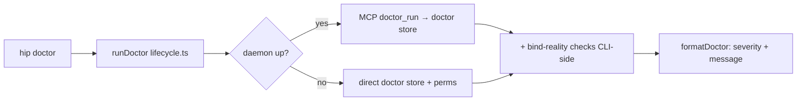

# feat: HIP operator binding & staleness fixes

## Summary

Five reference-implementation gaps bite operators who move a HIP daemon off loopback (loopback → mesh, e.g. Tailscale) or who `git pull` without rebuilding. None are protocol/spec gaps — all are CLI/daemon ergonomics in this repo. This plan implements the fixes:

1. A first-class `hip rebind <host>` command (and `hip install --host`) that **transactionally** (snapshot → rewrite → reload → verify → rollback-on-failure) rewrites the launchd plist host and the `config.json` url, reloads the daemon, and **verifies the remote path with an authenticated POST** — because the DNS-rebinding allowlist is derived from the bind host at startup and a stale in-memory allowlist returns `403` to remote clients while loopback keeps working. ("Atomic" here means transactional-with-rollback, not a single syscall — three side-effecting writes plus a process restart cannot be atomic, so the rollback contract is load-bearing, see KTD6.)
2. Dist-staleness detection (newest `src/**/*.ts` mtime vs `dist/cli/index.js`) surfaced at daemon startup and in `hip doctor`, so a source-ahead-of-dist checkout stops silently serving a stale daemon on the security path.
3. `hip doctor` gains bind-reality checks (plist↔config host mismatch, non-loopback bind ACL reminder, dist staleness) on top of today's store-consistency audit.
4. The token file is written without a trailing newline — a token-file-format contract tidy-up so external consumers comparing raw file bytes don't hit a phantom mismatch. (Hygiene/contract change, not a defect that bites today — internal reads already `.trim()`. No concrete consumer is named; if none ever materializes this is cheap insurance plus a documented format contract.)
5. `docs/binding.md` gains troubleshooting entries that disambiguate an empty-env Bearer `401` from a Host-allowlist `403`.

These five fixes map to six implementation units: U1 (token), U3 (rebind/install), U4 (staleness), U5 (doctor), U6 (docs), plus **U2 — a shared canonical-authority helper** that is enabling infrastructure for U3 and U5 rather than a sixth user-facing gap.

---

## Problem Frame

The daemon binds to `127.0.0.1:4319` by default and runs under a per-user launchd LaunchAgent. Host/port travel as `HIP_HOST`/`HIP_PORT` env vars baked into the plist (`src/daemon/launchd.ts:46-49`) and are read back by the CLI (`src/cli/lifecycle.ts:21-26`). The DNS-rebinding allowlist (`allowedHosts`/`allowedOrigins`) is **derived in code at daemon construction** from the bind host (`src/daemon/server.ts:53-68`), not from config. There are thus three independently-writable sources that must agree — the bind host (authoritative), the plist `HIP_HOST` env, and the `config.json` url — and the allowlist is a fourth, *derived* value that re-syncs only when the daemon restarts.

Consequences, all confirmed against source:

- **Rebinding is a manual multi-file edit with no command.** Moving off loopback means hand-editing the plist `HIP_HOST`, rewriting `config.json` url, reloading launchd, and hoping the allowlist regenerated. Miss the reload and remote clients get `403` while loopback masks it (`docs/solutions/integration-issues/dns-rebinding-allowlist-must-track-bind-host.md`).
- **Source-ahead-of-dist serves a stale daemon silently.** `dist/` is gitignored and built by vanilla `tsc` with no SHA stamp; `git pull` without `hip update` leaves the running daemon on old code — worst on the Host/allowlist security path.
- **`hip doctor` only audits the store** (`src/store/reindex.ts:120-185`) — index orphans, dangling events, timers. It says nothing about whether the daemon is reachable or safely bound.
- **The token file is written with a trailing `\n`** (`src/cli/config.ts:64`). Internal reads `.trim()` (`config.ts:36`) so it never bit us, but any external consumer hashing/comparing the raw file content sees a phantom mismatch.
- **An empty-env Bearer is indistinguishable from a bad token** — both yield `401` via `checkBearer` (`src/daemon/auth.ts:20-26`), reading as "wrong token" when the real cause is an unset env var.

**Target repo:** this repo (`@hip/cli`). The redacted machine-local primer is **out of scope** and stays out of this repo.

---

## Key Technical Decisions

### KTD1 — Bind-reality checks live CLI-side, not in the store `doctor()` / MCP `doctor_run`

`doctor(store)` (`src/store/reindex.ts:120-185`) is pure store-state and is called from two places: the MCP `doctor_run` tool inside the daemon (`src/tools/admin.ts:13-16`) and the CLI offline path (`src/cli/lifecycle.ts:181`). Bind-reality checks need config, plist, env, and filesystem mtimes — context the daemon-side store doctor does not and should not have. **Decision:** add bind-reality checks as a separate CLI-side function invoked from `runDoctor` in `lifecycle.ts`, appended to the store-doctor output. Keeps the MCP tool pure and store-scoped; puts network/fs checks where that context lives. Reuse the existing `DoctorIssue` shape (`{severity, code, message, id?}`) for uniform rendering.

### KTD2 — One bracketing helper, exported and shared

The learning mandates byte-for-byte agreement between the three writable sources (bind host, plist `HIP_HOST`, `config.json` url) so the derived allowlist re-syncs to a single byte form (a MagicDNS name only works if `HIP_HOST` is exactly that name; a bare IPv6 literal must render as `[addr]:port`). The bracketing logic exists today only as a private `hostPort()` in `src/daemon/server.ts:167-170`. **Decision:** export it (or lift to a shared util) and route `rebind`, `install --host`, and `urlFor()` through it — single source of truth for authority-string construction. Re-deriving it anywhere risks the exact desync this plan exists to fix.

**Lowercase before bracketing.** `hostPort()` only brackets; it does not normalize. Because all three writable sources go *through this one helper*, they already agree by construction — the residual risk is hand-edited plist/config in differing IPv6 spellings (uppercase, expanded, `%zone`). Cheap coverage: lowercase the host in the helper (handles the common typo) before bracketing. Full IPv6 compress/expand/zone-id normalization is **deferred** — add it only if U5's host-mismatch check shows real false-positives in practice; don't build the full normalizer up front.

### KTD3 — Rebind verifies the *remote* path with an authenticated POST, after a readiness poll

Because the allowlist regenerates only at daemon startup, a rewrite-without-reload leaves a stale allowlist; loopback requests still succeed and mask the failure. **Decision:** rebind's verify step issues a request whose `Host` header is the new bind host (not loopback) after reload, and treats a `403` as the desync failure.

Two non-obvious constraints make the naive version verify *nothing* (both confirmed against `src/daemon/server.ts:89-124`):

1. **Must be an authenticated POST, not a GET-style probe.** The daemon returns `405` for non-POST (`server.ts:95`) and `401` for missing/empty Bearer (`server.ts:97-100`) — both *before* the transport's Host/allowlist check ever runs (`server.ts:111-124`). A `403` is only producible by an authenticated POST that reaches the transport. So the verify must POST to `/mcp` with a valid `Authorization: Bearer <token>`, `content-type: application/json`, `accept: application/json, text/event-stream`, and a minimal JSON-RPC body (e.g. `tools/list`). Outcome mapping: `403` = stale allowlist (fail); `200`/MCP-result = allowlist OK (pass); `401`/`405`/`400` = the verify request itself is malformed (bug, not a desync); connection-refused/timeout = daemon not back yet (see below).
2. **Must poll for readiness, not fire once.** `launchctl kickstart -k` returns before the new process has bound. An immediate verify races the restart and gets connection-refused. **Decision:** poll the verify POST with bounded backoff (~5s budget, ~250ms interval); keep retrying on connection-refused/timeout, fail fast on a definitive `403`, pass on `200`. Only after the budget expires with no successful bind is it "unreachable" → rollback (KTD6). No fixed `sleep` (the `update.sh:62` `sleep 1` precedent is a guess, not a readiness signal).

### KTD6 — Rebind is transactional with rollback, not atomic

Three side-effecting writes (config, plist) plus a process restart cannot be atomic. A partial failure — plist+config rewritten to the new host but `kickstart` fails, or the daemon crash-loops on a not-yet-assigned interface (launchd `KeepAlive SuccessfulExit:false`, `launchd.ts:53-56`), or verify times out — leaves *exactly* the config↔daemon desync this plan exists to eliminate, and worse, behind a command the operator believes ran cleanly. **Decision:** snapshot the prior `config.json` and plist before mutating; on any failure after the writes (kickstart error, verify `403`, or readiness timeout), restore both files and re-`kickstart` to the prior host, then report the original error. Distinguish "stale allowlist" (`403`) from "daemon never came back / bind failed" (unreachable after the poll budget) in the error message, since the operator remedies them differently.

### KTD4 — Staleness via src-vs-dist mtime as a best-effort hint, not a guarantee

No build-SHA is stamped anywhere; `dist/` is gitignored; the build is a bare `tsc`. **Decision:** compare the newest `src/**/*.ts` mtime against `dist/cli/index.js` mtime (single marker; the build scripts already assert that file exists after a successful build, so a partial build doesn't produce a false-pass). No build-pipeline change, works from a gitignored dist.

**Honest framing — mtime is a weak proxy.** `git pull` sets working-tree mtimes to checkout-time, so the trigger case (pull-without-rebuild) is caught; but mtime false-negatives and false-positives both exist on the security path: an editor save / `touch` / formatter bumps `src` mtime with no semantic change (false "stale" → alarm fatigue on a security warning), and `cp -p`/rsync/Time-Machine restore preserve mtimes (breaks ordering). **Therefore:** the staleness signal is a `warn`-severity *hint*, never an `error`, and its wording says "may be stale — run `hip update` to be sure," not "is stale." A recorded `dist/BUILD_SHA` (compared to `git rev-parse HEAD`) is the reliable mechanism and is the recommended upgrade if the hint proves noisy or misses real cases; it is deferred only because it needs a build-pipeline change (see Scope Boundaries). Guards: return no-issue when `src/` is absent (npm package ships only `dist`) **and** when `dist/cli/index.js` is absent (dev tree mid-build) — symmetric, no false positives in either runtime.

### KTD5 — Token-newline fix is forward-only, relying on the existing trim

`loadConfig` already trims (`config.ts:36`), so dropping the trailing `\n` on write is backward-compatible: old newlined files still load, new files are clean. **Decision:** change the write to omit `\n`; existing installs get a clean token the next time `install`/`rebind` rewrites it. No separate migration pass — the rewrite paths already cover it. Preserve `0600` (security invariant from the learning).

---

## High-Level Technical Design

`hip rebind <host>` atomic sequence — the load-bearing flow. Reload-then-verify-remote is the part that prevents the silent `403`:

```mermaid
sequenceDiagram
    participant U as hip rebind <host>
    participant C as config.json
    participant P as plist (HIP_HOST)
    participant L as launchd
    participant D as daemon (allowlist)
    U->>U: reject 0.0.0.0 / :: (refuse before any write)
    U->>U: canonicalize + bracket(host) → authority (IPv6-safe)
    U->>U: snapshot prior config + plist (for rollback)
    U->>C: writeConfig(url=new authority, token re-passed, dataDir/actorId preserved)
    U->>P: buildPlist(host=new) → atomicWrite to plistPath()
    U->>L: launchctl kickstart -k gui/$uid/ai.hip.daemon (if under launchd)
    L->>D: restart → allowlist re-derived from new bind host
    loop readiness poll (~5s budget, ~250ms)
        U->>D: authenticated POST /mcp, Host: <new host>, Bearer token, JSON-RPC body
        Note over U,D: conn-refused/timeout → keep polling
    end
    alt 200 / MCP-result
        U-->>U: "rebound to <authority> — remote path verified"
    else 403 (stale allowlist) OR unreachable after budget
        U->>C: restore prior config
        U->>P: restore prior plist
        U->>L: re-kickstart to prior host
        U-->>U: stderr error + exit 1 (rolled back; report 403 vs unreachable distinctly)
    end
```

Doctor check placement (KTD1) — store doctor stays daemon-side and pure; bind-reality is CLI-only:



---

## Implementation Units

### U1. Token file written without trailing newline

**Goal:** Establish a clean token-file-format contract — the file holds exactly the token, no trailing whitespace — so any external consumer comparing raw bytes matches. Hygiene/contract change, not a defect fix (internal reads already `.trim()`). The format contract is documented in U6.
**Dependencies:** none.
**Files:** `src/cli/config.ts` (modify `writeConfig`, ~`:64`), `test/cli.test.ts` or `test/lifecycle.test.ts` (token-file assertions).
**Approach:** Change the token write from `token + "\n"` to `token` (no newline); keep `mode: 0o600` and the `chmodSync` follow-up. Leave `config.json`'s own trailing `\n` (`:63`) untouched — that is JSON formatting, not the token. `loadConfig` already `.trim()`s on read (`:36`), so old newlined files keep loading (KTD5).
**Patterns to follow:** existing `writeConfig` body and the 0600 assertion in `test/lifecycle.test.ts:64-81`.
**Test scenarios:**
- Happy path: after `writeConfig`, the token file content has no trailing newline and equals the exact token string (byte-for-byte).
- Backward compat: a token file written with a trailing `\n` still loads via `loadConfig` and yields the trimmed token (proves forward-only fix is safe).
- Permission: token file remains mode `0600` after the write.
**Verification:** `cat $(hip … tokenPath)` shows no trailing newline; `loadConfig` round-trips both clean and legacy files.

### U2. Shared IPv6-safe authority helper

**Goal:** One exported function canonicalizes + brackets a host into the `host[:port]` / `[v6]:port` authority string used by `urlFor`, `install`, and `rebind` so the three writable sources produce one byte form and the derived allowlist re-syncs (KTD2). Also give `urlFor()` an optional host-override parameter so `install --host` (U3) is a clean thread, not a half-refactor.
**Dependencies:** none.
**Files:** `src/daemon/server.ts` (export existing `hostPort`, ~`:167-170`) or a new `src/daemon/host.ts` re-exported from the daemon barrel; `src/cli/lifecycle.ts` (route `urlFor(hostOverride?)` through it, `:27-29`, and update the four in-`install` call sites `:110,118,140` to pass a single resolved host); `test/daemon.test.ts` or a focused unit test.
**Approach:** Export `hostPort(host, port)` (brackets when `host.includes(":") && !host.startsWith("[")`), preceded by a canonicalization step (lowercase; for IPv6, compress via `node:net`; decide zone-id handling explicitly) so equivalent spellings collapse to one form. Change `urlFor(hostOverride?: string)` to compose `http://${hostPort(hostOverride ?? host(), port())}/mcp`; `install()` computes `const h = opts.host ?? host()` once and passes `h` to both `urlFor(h)` and `buildPlist({host: h})`. No behavior change for existing loopback/IPv4 callers — pure refactor.
**Patterns to follow:** the existing private `hostPort()` and the IPv6 url test at `test/daemon.test.ts:59-65`.
**Test scenarios:**
- Happy path: IPv4 host `127.0.0.1` → `127.0.0.1:4319`; hostname `daemon.tailnet.ts.net` → `daemon.tailnet.ts.net:4319`.
- Edge: bare IPv6 `fd7a:1:2::3` → `[fd7a:1:2::3]:4319`; already-bracketed `[fd7a:1:2::3]` → not double-bracketed.
- Lowercasing: uppercase `FD7A:1:2::3` → `[fd7a:1:2::3]:4319` (common-typo coverage). Expanded/zone-id collapsing is explicitly out of scope here (deferred per KTD2).
- Override: `urlFor("h")` yields `http://h:4319/mcp`; `urlFor()` (no arg) reproduces today's env-default output for the default loopback case.
**Verification:** `urlFor()` and the new helper produce identical, canonical authority strings for every host class and equivalent-IPv6 spelling; no existing daemon/lifecycle test regresses.

### U3. `hip rebind <host>` + `hip install --host`

**Goal:** A single atomic path rewrites plist host + config url, reloads the daemon, and verifies the remote path (KTD3). `install --host` reuses the same authority/plist logic for first-time non-loopback installs.
**Dependencies:** U2 (authority helper).
**Files:** `src/cli/lifecycle.ts` (new exported `rebind(host)` fn + register in `registerLifecycleCommands`; add `--host` option + threading to `install`), `test/lifecycle.test.ts`, `test/daemon.test.ts` (remote-Host verify).
**Approach:**
- `rebind(host)` — transactional (KTD6):
  1. **Reject unsafe input first, before any write:** `host === "0.0.0.0"` or `"::"` (all-interfaces) → stderr error + exit 1, no files touched. The plan's "never 0.0.0.0" is enforced at the write path, not just warned by doctor.
  2. `loadConfig()` (actionable `ConfigError` if not installed) → compute the canonical authority via U2.
  3. **Snapshot** the prior `config.json` and plist contents in memory for rollback.
  4. `writeConfig({ url: newUrl, token: cfg.token, actorId: cfg.actorId, dataDir: cfg.dataDir })` (full-shape rewrite; no partial update exists — re-pass the existing token) → regenerate plist via `buildPlist({...existing, host})` and `atomicWrite` it (`src/store/index.ts:5`).
  5. **Reload only if under launchd:** mirror `scripts/update.sh:57-67` — detect `launchctl list | grep ai.hip.daemon`; if present, `launchctl kickstart -k "gui/$(id -u)/ai.hip.daemon"` with the `unload || true; load` fallback. If the daemon runs via a manual `hip serve` (not launchd), skip kickstart, skip verify-as-if-reloaded, and print explicit "config + plist written — restart your `hip serve` to pick up the new host" guidance (no extra flag; the files are already correct). Gate kickstart on `process.platform === "darwin"`; on other platforms write files, skip reload+verify, print "launchd unavailable on this platform — reload manually."
  6. **Verify (KTD3):** readiness-poll an authenticated POST to `http://<new authority>/mcp` (Bearer token, `content-type: application/json`, `accept: application/json, text/event-stream`, minimal `tools/list` body) carrying `Host: <new host>`. `200`/MCP-result → success; `403` → stale allowlist (fail fast); conn-refused/timeout → keep polling to budget, then "unreachable."
  7. **On any post-write failure (kickstart error, `403`, or unreachable-after-budget):** restore the snapshot (config + plist), re-kickstart to the prior host, and report the original error, distinguishing `403` (stale allowlist) from unreachable (bind failed / crash-loop).
  8. Non-loopback success prints the ACL/security reminder (token is now the sole gate; pair with network ACLs; keep token `0600`).
- `install --host <host>`: thread the host override through `install()` (U2 helper) so `urlFor()`/`buildPlist` use it. **Running-daemon guard:** `install` does not reload today, so `install --host` on a machine with a running daemon would write a new plist while the daemon keeps the old allowlist — the silent mismatch this plan exists to kill. Detect a running daemon (loaded launchd label or reachable url); if found, either route through `rebind`'s reload+verify or refuse with "a daemon is running — use `hip rebind <host>`." Default-loopback `install` (no `--host`) is unchanged.
**Execution note:** Start from a failing `test/lifecycle.test.ts` round-trip that rebinds to a non-loopback host on a free port and asserts the new authority lands in both plist and config — then add the rollback and verify-shape tests, the riskiest contracts.
**Patterns to follow:** `install()`/`uninstall()` exported-string shape (`lifecycle.ts:95,144`), command registration block (`lifecycle.ts:294-300`), env-swap test harness (`lifecycle.test.ts:29-44`), the full authenticated-POST request shape from the `403` test (`daemon.test.ts:226-248`), reload + non-launchd branch precedent (`scripts/update.sh:57-67`).
**Test scenarios:**
- Happy path: `rebind tailnet-name` rewrites `config.json` url to `http://tailnet-name:4319/mcp` AND plist `HIP_HOST` to `tailnet-name`, both in one call.
- IPv6: `rebind FD7A:1:2::3` yields lowercased `http://[fd7a:1:2::3]:4319/mcp` in config and matching plist (Covers the KTD2 lowercase+bracket invariant end-to-end).
- Input rejection: `rebind 0.0.0.0` and `rebind ::` exit non-zero with **no file writes** (assert config/plist unchanged on disk).
- Verify success: after rebind to a non-loopback host on a test port, an authenticated POST with `Host: <new host>` is admitted (`200`, not `403`).
- Verify shape guard: a GET / unauthenticated / non-POST verify must NOT be treated as success — assert the verify path uses an authenticated POST (a `405`/`401` is a verify bug, distinct from a `403` desync).
- Verify failure → rollback: simulate a stale allowlist so the remote-Host POST `403`s → `rebind` restores prior config+plist, re-kickstarts the old host, and exits non-zero with a desync message. Loopback success must NOT mask it.
- Readiness race: inject restart latency so the first verify hits connection-refused → the poll retries and still succeeds within budget (no spurious rollback).
- Not-under-launchd: with the daemon run manually (no launchd label), `rebind` writes files, skips kickstart, and prints manual-restart guidance instead of a launchd-shaped failure.
- Token preserved: token file unchanged (same value) and still `0600` after rebind and after rollback.
- `install --host h`: plist `HIP_HOST` and config url both reflect `h`; omitting `--host` reproduces today's default loopback install.
- `install --host` running-daemon guard: with a daemon running, `install --host` either reloads+verifies or refuses with the `hip rebind` hint — it does not silently leave a plist/daemon mismatch.
**Verification:** end-to-end rebind to a non-loopback host leaves plist, config, allowlist, and an authenticated remote POST all consistent; a forced failure rolls back to the prior host cleanly; default install behavior unchanged.

### U4. Dist-staleness detection

**Goal:** A shared **best-effort hint** (never an error) reports when `dist` looks older than `src`, nudging `hip update` before a source-ahead-of-dist checkout silently serves stale code (KTD4). Explicitly a hint, not a guarantee — mtime is a weak proxy.
**Dependencies:** none.
**Files:** `src/cli/lifecycle.ts` (new `checkDistStaleness()` returning a `DoctorIssue | null`; call from `serve()` startup), `test/lifecycle.test.ts`.
**Approach:** Resolve repo root via the existing `repoRoot()` (`lifecycle.ts:260`). **Symmetric guards (KTD4):** return `null` when `src/` is absent (npm-shipped package) AND when `dist/cli/index.js` is absent (dev tree mid-build) — no false positives in either runtime. Otherwise compare the newest `src/**/*.ts` mtime against `dist/cli/index.js` mtime (single marker — `install.sh:49-53`/`update.sh:39-43` already assert this file exists after a successful build, so a partial-build false-pass is already guarded). If src is newer, return a `warn`-severity `DoctorIssue` (`code: "dist-stale"`) whose message says "dist **may be** stale — run `hip update` to be sure" (hedged wording, since `touch`/editor-save/`cp -p` can trip mtime without a real change). In `serve()` (`lifecycle.ts:38-86`), emit it to stderr at startup (existing error-handling style) without blocking the daemon.
**Patterns to follow:** `statSync` already imported (`lifecycle.ts:2`); `repoRoot()` (`:260`); stderr write convention in the `serve` action (`:288-291`).
**Test scenarios:**
- Happy path: dist newer than src → `null` (no issue), daemon starts clean.
- Stale: touch a `src/*.ts` newer than `dist/cli/index.js` → a `dist-stale` warn issue with hedged wording.
- npm-package guard: no `src/` dir → returns `null`.
- Dev-mid-build guard: no `dist/cli/index.js` → returns `null` (the `serve()` round-trip test runs under tsx against `src`, where dist state is nondeterministic — assert the warning is non-fatal, not its presence).
- Startup: `serve()` writes any staleness warning to stderr but still binds and serves.
**Verification:** a deliberately stale checkout surfaces the hedged hint at `serve` startup and in `hip doctor` (U5); a fresh build and a no-dist dev tree are both silent; the daemon never fails to start over staleness.

### U5. `hip doctor` bind-reality checks

**Goal:** `hip doctor` reports plist↔config host mismatch, a non-loopback bind ACL reminder, and dist staleness — on top of the existing store audit (KTD1).
**Dependencies:** U2 (authority helper), U4 (staleness check).
**Files:** `src/cli/lifecycle.ts` (new `bindRealityChecks()` returning `DoctorIssue[]`; append in `runDoctor`, `:178-186`; extend `formatDoctor` to render `severity`, `:228-231`), `src/tools/admin.ts` (`doctor_run` scope note, `:13-16`), `test/lifecycle.test.ts`.
**Approach:** Build a CLI-side `bindRealityChecks()` that: (a) parses the plist `HIP_HOST`, canonicalizes both it and the host implied by `config.json` url via the U2 helper, and compares **canonical** forms — mismatch → `error` `host-mismatch` (canonical compare so equivalent IPv6 spellings don't false-positive); (b) bind-host severity is split, matching the plan's own "never 0.0.0.0": all-interfaces bind (`0.0.0.0`/`::`) → `error` `bind-all-interfaces` (flips `ok`); a scoped non-loopback bind (tailnet name/IP) → `warn` `non-loopback-bind`; (c) include the `checkDistStaleness()` result from U4. Append to the store-doctor issues in `runDoctor`. Update `formatDoctor` (prints `message` only today) to prefix `severity`. Keep `ok` semantics (errors flip `ok`, warnings do not), matching `reindex.ts:184`.
**Reminder must not imply verification occurred.** The non-loopback reminder is advice, not a check — HIP cannot confirm a firewall/Tailscale ACL exists. Word it as "HIP cannot verify network ACLs are in place; once bound beyond loopback the token is the sole gate — keep it `0600` and restrict the port at the network layer," not anything that reads as a satisfied checkbox while `ok` stays true.
**CLI vs MCP doctor scope (KTD1 follow-through).** Bind-reality checks stay CLI-side, but the in-daemon `doctor_run` (`admin.ts:13-16`) must not silently look "healthy" while a host-mismatch exists. Have `doctor_run` append a note — "bind-reality checks (host mismatch, bind safety, dist staleness) are available only via `hip doctor` (CLI)" — so an agent/MCP caller knows its result is store-scoped and partial. Document the two-doctor scope split in U6.
**Patterns to follow:** `DoctorIssue` shape (`reindex.ts:103-108`), `runDoctor` online/offline wrapper (`lifecycle.ts:178-186`), `formatDoctor` (`:228-231`), `permsReport` (`:234-246`) as the model for a CLI-side fs/perms check.
**Test scenarios:**
- Happy path: matching (canonical) plist host and config url, loopback bind, fresh dist → no bind-reality issues (only store doctor runs).
- Host mismatch: plist `HIP_HOST=a` but config url host `b` → `error` `host-mismatch`; `ok` becomes false.
- Canonical equality: plist `FD7A::3` and config `[fd7a::3]` (equivalent) → NO mismatch (canonical compare; guards against false-positive).
- All-interfaces: bind host `0.0.0.0` or `::` → `error` `bind-all-interfaces`, `ok` becomes false (not a mere warn).
- Scoped non-loopback: a tailnet name/IP → `warn` `non-loopback-bind` with the no-verification-implied reminder; `ok` stays true.
- Staleness surfaced: a stale dist (from U4) appears as a doctor `warn` with hedged wording.
- Rendering: `formatDoctor` shows severity so `error` is distinguishable from `warn`.
- MCP scope note: `doctor_run` returns store-only results PLUS the "use `hip doctor` for bind-reality" note — it never reports a clean bill while a CLI-side bind issue exists.
**Verification:** `hip doctor` on a desynced/all-interfaces/scoped-non-loopback/stale install reports the right issue and severity; a clean loopback install is clean; `doctor_run` over MCP stays store-scoped but signals its partial scope.

### U6. `binding.md` Bearer/Host troubleshooting

**Goal:** Operators can tell an empty-env Bearer `401` apart from a Host-allowlist `403`.
**Dependencies:** none in code. Documents behavior from U1/U3/U5, so it reads best after they land, but it can ship as a docs-only PR at any time.
**Files:** `docs/binding.md` (extend the troubleshooting section, around the existing `401`/`403` notes at `:18-20`, `:50-51`).
**Approach:** Add these entries. (1) **`401 unauthorized`** — missing/empty/malformed `Authorization` header; the usual real cause is an unset env var interpolating to an empty Bearer (`Authorization: Bearer ` with nothing after). Show how to confirm the env var is populated before suspecting the token. (2) **`403`** — Host/Origin not in the DNS-rebinding allowlist (a bind/connect-string mismatch), distinct from `401`; cross-reference `hip rebind` and the security note that once bound beyond loopback the token is the sole gate. Do not conflate the two gates. (3) **Token-file format contract** (from U1) — the token file holds exactly the token with no trailing newline; compare trimmed values, not raw bytes; existing installs keep their legacy newline until the next `install`/`rebind` rewrite (transition note, so an external consumer expecting clean bytes knows when the change lands). (4) **Two `doctor` scopes** (from U5) — `hip doctor` (CLI) runs store + bind-reality checks; the MCP `doctor_run` is store-scoped only and says so; use the CLI one to diagnose host-mismatch / bind-safety / staleness.
**Patterns to follow:** existing `docs/binding.md` voice and the normative `401`/`403` lines already present; the separation discipline from `docs/solutions/integration-issues/dns-rebinding-allowlist-must-track-bind-host.md`.
**Test expectation:** none — documentation only.
**Verification:** `401` vs `403` have distinct, non-conflated entries each pointing at the correct gate and command; the token-format contract and the two-doctor scope split are documented.

---

## Scope Boundaries

**In scope:** the five fixes above as CLI/daemon/docs changes in this repo.

### Deferred to Follow-Up Work
- **Recorded `dist/BUILD_SHA` + "built-SHA ≠ HEAD" check.** mtime (KTD4) covers "dist older than src" without a build-pipeline change. A precise SHA marker would need `scripts/update.sh` (which already computes the short SHA at `:34`) to write `dist/BUILD_SHA` and a runtime reader. Defer until mtime proves insufficient.
- **`hip rebind --port`.** This plan scopes rebind to host; a port variant is a natural follow-up.
- **`/ce-compound` entries** for the staleness detection and token-newline fix — no institutional precedent exists yet (per learnings research). File after the work lands.

### Out of scope (not this product's concern here)
- Protocol/spec changes (`docs/spec.md`) — every gap is reference-impl, not protocol.
- The redacted machine-local upstream primer (`machines/…`) — stays out of this repo.

---

## Risks & Dependencies

- **Verify request shape is load-bearing (highest risk).** A GET-style or unauthenticated verify hits the daemon's `405`/`401` guards *before* the allowlist `403` (`server.ts:89-124`) — so the headline safety check would verify nothing. The verify MUST be an authenticated POST, and only a `403` counts as a desync (KTD3). U3's verify-shape test guards this.
- **No rollback = the failure this plan exists to prevent.** A partial rebind (files rewritten, reload/verify fails) leaves config↔daemon desync behind a command the operator thinks succeeded — worse than the manual state. The snapshot/restore contract (KTD6) is mandatory, not nice-to-have; U3's rollback test guards it.
- **Reload race / readiness.** `launchctl kickstart -k` returns before the daemon rebinds; an immediate verify races it. Bounded readiness poll (KTD3), distinguishing connection-refused (retry) from `403` (fail fast), prevents spurious rollbacks.
- **`install --host` on a running daemon** can silently reintroduce a plist/daemon mismatch (install does not reload). U3's guard routes it through reload+verify or refuses with the `hip rebind` hint.
- **Loopback-only verify** would pass even when the allowlist is stale. (Source: `docs/solutions/integration-issues/dns-rebinding-allowlist-must-track-bind-host.md`.)
- **launchd reload portability + manual-serve case.** `launchctl kickstart -k` is macOS-only; mirror `update.sh:57-67`'s unload/load fallback AND its not-under-launchd branch. Non-macOS / manual-`serve` rebind writes files but skips reload+verify with explicit guidance, rather than failing or silently no-opping.
- **mtime staleness is a hint, not a guarantee.** It false-positives (editor save, `touch`) and false-negatives (`cp -p`, restore) on the very security path it targets; kept `warn`-only with hedged wording (KTD4). `dist/BUILD_SHA` is the reliable upgrade (deferred).
- **`doctor` two-scope honesty.** CLI doctor gains bind-reality; the MCP `doctor_run` stays store-scoped (KTD1) but must announce its partial scope so an agent caller is not misled (U5).
- **Security invariant intersection.** Token-newline write (U1) and any rebind/install rewrite must preserve `0600`; `0.0.0.0`/`::` is rejected at the rebind write path and is a doctor `error` (not a warn).
- **Dependency order:** U2 before U3 and U5; U4 before U5. U1 and U6 are independent and can land any time (U6 references behavior from U1/U3/U5 but has no code dependency on them).

---

## Sources & Research

- Source grounding: `src/cli/lifecycle.ts` (`:21-29` host/url, `:110` install writeConfig, `:129` plist host, `:155-176` status, `:178-186`/`:228-231` doctor, `:260-276` repoRoot/update), `src/cli/config.ts:36,64`, `src/daemon/server.ts:18-19,53-68,97-100,167-170`, `src/daemon/auth.ts:20-26`, `src/daemon/launchd.ts:4-49`, `src/store/reindex.ts:103-185`, `src/tools/admin.ts:13-16`, `scripts/update.sh:34,57-62`.
- Institutional learning: `docs/solutions/integration-issues/dns-rebinding-allowlist-must-track-bind-host.md` (2026-06-13, current) — the canonical record for rebind, bind-reality doctor checks, IPv6 bracketing, and the "config-only is suspect for network boundaries" principle.
- Tests to mirror: `test/lifecycle.test.ts` (env-swap harness, plist/install asserts, `serve()` round-trip), `test/daemon.test.ts:59-65,226-248` (IPv6 url, raw-fetch `401`/`403` status asserts), `test/helpers.ts` (`tmpRoot`).
- No external research run — local patterns strong, the one security-critical path is fully documented in the learning above.
- Deepened 2026-06-14 via parallel doc-review (coherence, feasibility, security-lens, adversarial). Feasibility verified every cited file:line anchor against source. Two blocking findings drove the largest revisions: the verify request must be an authenticated POST (a GET/unauth probe hits `405`/`401` before the allowlist `403`, verifying nothing — `server.ts:89-124`), and rebind needs a snapshot/rollback contract since it is transactional, not atomic. Also integrated: readiness-poll the verify, reject `0.0.0.0`/`::` at the write path (doctor `error`, not warn), canonicalize IPv6 before compare, soften mtime staleness to a hedged hint, guard the not-under-launchd/manual-serve case, guard `install --host` against a running daemon, and have the MCP `doctor_run` announce its store-only scope.
