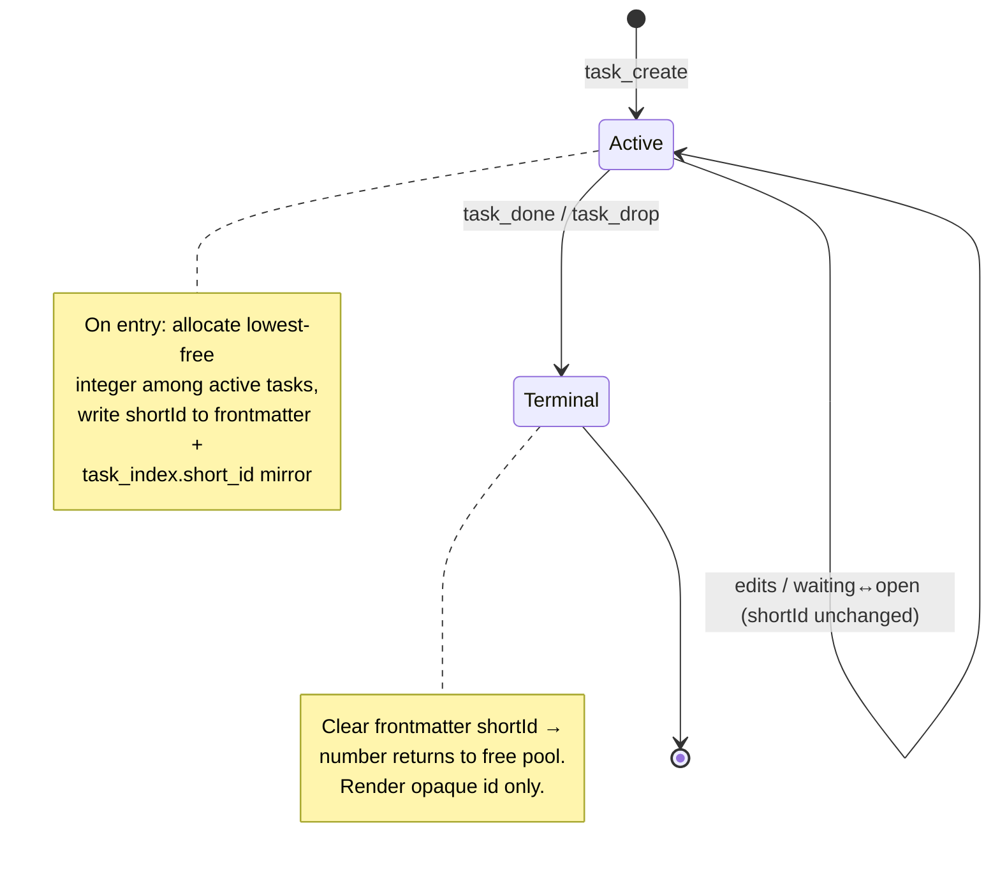
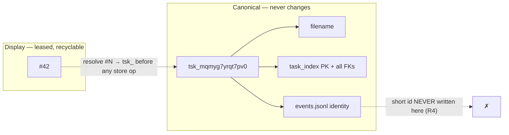

# feat: Short recycling task IDs, terser digest, and actor_delete

## Summary

Three related improvements to the human-facing surface of HIP (Human Inbox Protocol), all driven by the `hip-daily-digest` output being hard to read:

1. **Short recycling task IDs** — give every active Task a small human-facing number (`#42`) alongside its opaque `tsk_…` id. Numbers are leased to active Tasks, freed when a Task goes terminal, and reused (lowest-free-first) so a person rarely tracks more than a couple hundred at once — never thousands.
2. **Terser digest (in-repo portion)** — trim the in-repo gap-ranking surface and add the short id to the wire payload so the digest reads `#42` instead of `tsk_mqmyg7yrqt7pv0`. The literal digest text lives in a private repo (see Scope Boundaries); this plan does the in-repo half and flags the rest.
3. **`actor_delete`** — a confirmed protocol gap ("No actor_delete tool — cannot remove a mis-created actor"). Add a hard delete that succeeds only when the Actor is completely unreferenced, refusing safely otherwise.

**Plan depth:** Deep — cross-cutting (storage → domain → tools → CLI), introduces one new abstraction (the short-id allocator), and the recycling + append-only-event-log interaction needs careful design.

---

## Problem Frame

The `hip-daily-digest` cron output (observed 2026-06-20) is noisy. The worst offender is the raw opaque id printed inline:

> 🔍 Protocol gaps to triage (1)
> • [tsk_mqmyg7yrqt7pv0] No actor_delete tool — cannot remove a mis-created actor

`tsk_mqmyg7yrqt7pv0` carries no meaning to a human, is hard to read aloud or type, and dominates the line. The user wants a small stable number per active item, capped in practice so the mental load stays bounded ("no more than 999 numbers to wrap your head around"). The same digest also surfaced a real missing capability (`actor_delete`), which is in scope here.

**Why recycling, not a monotonic counter:** a never-reused counter grows without bound and reintroduces the mental-load problem over months. Leasing numbers to *active* Tasks only — and reclaiming them on `done`/`dropped` — keeps the live set small by construction. (User decision, 2026-06-20.)

**The load-bearing constraint:** the opaque `tsk_…` id is the Task's on-disk filename, its SQLite primary key, every foreign key, and its identity in the append-only `events.jsonl`. The short id must be **purely additive and display-only** — it never replaces the opaque id and is **never written to the event log**, because a recycled `#42` appearing in historical events would make that append-only log ambiguous (flagged by learnings research, 2026-06-20).

---

## Requirements

- **R1** — Each active Task (`open` or `waiting`) carries a short positive-integer display id rendered as `#N`.
- **R2** — Short ids recycle: a new active Task receives the lowest positive integer not currently held by another active Task; the number is freed when the Task becomes `done` or `dropped`.
- **R3** — The opaque `tsk_…` id remains canonical and unchanged as filename, primary key, every foreign key, and event-log identity.
- **R4** — Short ids are **never** written to the append-only event log (`events.jsonl`). The event log references opaque ids only.
- **R5** — A Task's short id survives `hip reindex` (it must derive from authoritative state, not from a wiped derived table).
- **R6** — Short ids appear in the MCP wire payload (`WireTask`) and CLI output; CLI/tool inputs accept `#N` (and bare `N`) as an alias that resolves to the opaque id.
- **R7** — The in-repo digest/gap surface is trimmed: the `hip-gaps` ranking lists short ids rather than full opaque ids and emits fewer lines per gap.
- **R8** — `actor_delete` removes an Actor only when no Task, Execution, event, `waitingOn`, or creation-key references it; otherwise it refuses with a clear reason naming the blocking references.

---

## Key Technical Decisions

- **KTD1 — Short id is a display-only lease, opaque id stays canonical.** The short id is presentation metadata. Nothing keys off it internally; resolution always maps `#N → tsk_…` before any store operation. *(see origin: user decision "Recycle lowest-free", 2026-06-20)*
- **KTD2 — Authoritative storage in Task frontmatter, derived mirror in `task_index`.** The chosen number is written to the Task's markdown frontmatter (`shortId`) — authoritative, travels with the data dir, and survives `hip reindex` (satisfies R5). A `short_id INTEGER` column on the derived `task_index` table mirrors it for fast lookup and active-set queries; `src/store/indexer.ts` re-derives it on every reindex. This follows the existing derived-vs-authoritative split documented for `task_index`.
- **KTD3 — Allocation = lowest free integer among active Tasks, computed synchronously.** `better-sqlite3` is synchronous and the daemon is a single local process, so "read active short ids → pick lowest gap → write" has no race. No `AUTOINCREMENT` (it renumbers on reindex and never reuses).
- **KTD4 — Free on terminal by clearing the frontmatter `shortId`.** When a Task transitions to `done`/`dropped`, its `shortId` is cleared so the number returns to the free pool. `done`/`dropped` are terminal (no task reopen exists), so a freed number is never reclaimed by its old owner. Terminal Tasks render with their opaque id only.
- **KTD5 — Migration mirrors the `is_demo` precedent.** Bump `SCHEMA_VERSION` 4→5; add `short_id` to the `task_index` `CREATE TABLE` for fresh DBs and a guarded `ALTER TABLE task_index ADD COLUMN short_id` (column-existence check first, per the existing `is_demo` v3 block) for upgrades. A backfill pass allocates short ids to existing active Tasks on first reindex after upgrade.
- **KTD6 — `actor_delete` is hard-delete-only-when-unreferenced.** Mirrors the "mis-created actor" need precisely. No new lifecycle state (soft-archive deferred). The referential check counts references across all stores before deleting the Actor's markdown file and any derived rows. *(see origin: user decision "Hard-delete only if unreferenced", 2026-06-20)*
- **KTD7 — Digest verbosity is split.** The literal "HIP action items" text is generated by the private Hermes digest skill (out of this repo). This plan does the in-repo half — short id on the wire payload + trimmed `hip-gaps` listing — and records the private-skill change as deferred follow-up. *(see origin: user decision "In-repo only + flag follow-up", 2026-06-20)*

---

## High-Level Technical Design

Short-id lifecycle and the canonical-vs-display layering:

Identifier layering (what each id is for):

*Directional guidance for reviewers — not implementation specification.*

---

## Implementation Units

### U1. Persist and migrate short-id storage

- **Goal:** Add the authoritative `shortId` frontmatter field, the derived `task_index.short_id` mirror, and the schema migration — no allocation logic yet.
- **Requirements:** R3, R5; foundation for R1, R2.
- **Dependencies:** none.
- **Files:**
  - `src/types.ts` — add optional `shortId?: number` to the Task type and `WireTask`.
  - `src/store/db.ts` — add `short_id INTEGER` to the `task_index` `CREATE TABLE`; bump `SCHEMA_VERSION` 4→5; add a guarded `ALTER TABLE task_index ADD COLUMN short_id` in `openDb()` modeled on the `is_demo` block.
  - `src/store/frontmatter.ts` / `src/store/markdown.ts` — read/write `shortId` in Task frontmatter.
  - `src/store/indexer.ts` — write `short_id` from frontmatter into `task_index` in `indexTask`.
  - `test/store.test.ts` — migration + round-trip coverage.
- **Approach:** `shortId` is authoritative in frontmatter; the SQLite column is a derived mirror re-populated by `indexTask` and therefore safe to wipe/rebuild on `hip reindex`. No allocation or freeing here — a Task simply round-trips whatever `shortId` it already has.
- **Patterns to follow:** the `is_demo` v3 migration block in `src/store/db.ts` (column-existence check → `ALTER TABLE`); the single-write-path discipline of `src/store/indexer.ts`.
- **Test scenarios:**
  - Opening a v4 DB upgrades it to v5 and adds the `short_id` column without dropping existing rows.
  - Opening a fresh DB creates `task_index` already carrying `short_id`.
  - A Task with `shortId: 7` in frontmatter round-trips through write → read with `shortId` intact.
  - `indexTask` writes the frontmatter `shortId` into `task_index.short_id`; a reindex rebuilds the column from frontmatter (no data loss).
  - A Task with no `shortId` indexes as `short_id = NULL`.

### U2. Short-id allocator and lifecycle

- **Goal:** Allocate the lowest free number to a Task on creation and free it on terminal transition; backfill existing active Tasks.
- **Requirements:** R1, R2, R4; advances R5.
- **Dependencies:** U1.
- **Files:**
  - `src/domain/shortid.ts` *(new)* — `allocateShortId(store)`: compute the lowest free integer among active Tasks.
  - `src/store/store.ts` — query method returning the set of `short_id` values held by active (`open`/`waiting`) Tasks.
  - `src/domain/tasks.ts` — in `createTask`, allocate and set `shortId`; in the `task_done` / `task_drop` transitions, clear `shortId` inline (no separate free-helper — it is a single field reset).
  - `src/store/reindex.ts` — backfill: assign short ids to active Tasks lacking one (first reindex after upgrade).
  - `test/domain.test.ts` — allocation, freeing, recycling, backfill.
- **Approach:** Allocation reads the active short-id set, picks the smallest positive integer not present, writes it to frontmatter (authoritative) and lets `indexTask` mirror it. Freeing nulls the frontmatter `shortId` during the terminal transition. **R4 guard:** the value is written only to frontmatter + the derived index — never passed to the `event()` helper or into `events.jsonl`. No hard cap at 999 (the user's bound is steady-state, not a limit); allocation continues past 999 if ever needed.
- **Execution note:** Start with a failing test for the recycling invariant (drop `#2` of `#1,#2,#3`, create a new Task, assert it reuses `#2`) before wiring allocation into `createTask`.
- **Patterns to follow:** state transitions in `src/domain/tasks.ts` (`task_drop`, `task_done` as dedicated write paths — one verb per transition).
- **Test scenarios:**
  - First Task created in an empty store gets `#1`.
  - Three Tasks get `#1,#2,#3`; dropping `#2` then creating a new Task yields `#2` (lowest-free reuse).
  - A Task transitioning `done` clears its `shortId`; the number is then reused by the next create.
  - `waiting ↔ open` transitions leave `shortId` unchanged (still active).
  - Backfill assigns contiguous short ids to pre-existing active Tasks and skips terminal ones.
  - **R4:** after create and after terminal transition, the emitted events in `events.jsonl` contain only the opaque id — no `shortId` field anywhere in the event payloads.
  - Allocation past 999 active Tasks returns `#1000` without error.

### U3. Render short ids on the wire and in the CLI

- **Goal:** Surface `#N` in the MCP wire payload and CLI output (the single highest-leverage display change — reaches the digest skill, MCP consumers, and CLI uniformly).
- **Requirements:** R6 (render half); enables R7.
- **Dependencies:** U1, U2.
- **Files:**
  - `src/tools/tasks.ts` — `lowerTaskState`/`wire` mapping carries `shortId` onto `WireTask`.
  - `src/cli/commands.ts` — `renderTaskLine` and `renderTaskView` show `#N` (with the opaque id available on `hip show` for power use).
  - `src/cli/tty.ts` — reuse the existing `colorId` chokepoint for `#N` (no new coloring helper unless the dim rule later diverges).
  - `test/` — CLI render + wire-mapping coverage.
- **Approach:** `WireTask` is the universal external DTO, so adding `shortId` there is the one change that reaches every consumer. CLI list lines lead with `#N`; the detail view keeps the opaque id visible for commands/debugging. Terminal Tasks (no `shortId`) fall back to the opaque id.
- **Patterns to follow:** `colorId()` chokepoint in `src/cli/tty.ts`; the "every CLI command body returns a printable string" testability convention.
- **Test scenarios:**
  - `lowerTaskState` on a Task with `shortId: 42` produces `WireTask.shortId === 42`.
  - `renderTaskLine` for an active Task shows `#42`; for a terminal Task (no short id) shows the opaque id.
  - `renderTaskView` shows both `#42` and the opaque `tsk_…` id.
  - A Task with no `shortId` renders without a stray `#` / `#undefined`.

### U4. Accept `#N` as an input alias

- **Goal:** Let CLI commands and tools take `#42` (or bare `42`) and resolve it to the opaque id before any store call.
- **Requirements:** R6 (input half).
- **Dependencies:** U1, U2.
- **Files:**
  - `src/domain/` or `src/store/store.ts` — `resolveTaskRef(ref)`: if `ref` matches `#?\d+`, look up the active Task with that `short_id`; else treat as opaque id.
  - `src/cli/inspect.ts`, `src/cli/inbox.ts` — route `<taskId>` args through the resolver.
  - `src/tools/tasks.ts` — `task_read` and other id-taking tools resolve `#N` before use (inputs stay `z.string()`).
  - `test/` — resolution + ambiguity coverage.
- **Approach:** Resolution is lookup-among-active, so each live number maps to exactly one Task (unambiguous). A `#N` that matches no active Task returns a clear "no active task #N" error. Opaque ids continue to work unchanged. Terminal Tasks are addressable only by opaque id (their number may now belong to someone else).
- **Test scenarios:**
  - `resolveTaskRef("#42")` and `resolveTaskRef("42")` both return the opaque id of the active Task holding `#42`.
  - `resolveTaskRef("tsk_…")` returns it unchanged (passthrough).
  - `#999` with no active holder returns a not-found error, not a silent miss.
  - After `#2` is freed and reassigned, resolving `#2` returns the new owner, never the old terminal Task.
  - `hip show #42` and `hip show tsk_…` resolve to the same Task.

### U5. Trim the in-repo digest / gap surface

- **Goal:** Reduce verbosity of the gap-ranking output and document the new short-id field in the digest contract.
- **Requirements:** R7.
- **Dependencies:** U3.
- **Files:**
  - `skills/hip-gaps/SKILL.md` — revise the ranking procedure to list `#N` instead of full opaque ids and to emit fewer lines per gap group (drop redundant excerpts; one tight line per gap).
  - `docs/hermes-integration.md` — note `shortId` on `WireTask` in the "Querying state (the digest)" contract so the private digest skill can adopt it.
- **Approach:** This is the in-repo half of the verbosity fix. The literal "HIP action items" / "Protocol gaps to triage" text is rendered by the private Hermes digest skill — recorded under Deferred Follow-Up Work. Within this repo, the gap-ranking recipe and the wire payload are what we control; tightening both materially shrinks what the digest skill has to print.
- **Patterns to follow:** existing structure and tone of `skills/hip-gaps/SKILL.md`.
- **Test expectation:** none — these are a markdown skill recipe and a contract doc, no behavioral code. Verify by reading the revised procedure against a sample gap set.

### U6. `actor_delete` tool (hard-delete only when unreferenced)

- **Goal:** Add an `actor_delete` MCP tool that removes a mis-created Actor when nothing references it, and refuses with a clear reason otherwise.
- **Requirements:** R8.
- **Dependencies:** none (independent of the short-id work).
- **Files:**
  - `src/store/store.ts` — reference-count queries: Tasks with `delegatedBy.actor`, `state.onActor`, `nextActionOn`, or `watcher` equal to the actor; Executions with `actor`; events referencing the actor; `creation_keys.actor_id` rows.
  - `src/domain/actors.ts` — `deleteActor(store, actorId)`: gather references inline; if any exist, throw a structured "actor in use" error listing the blockers; if none, delete the actor markdown file and any derived rows. (No separate `requireActorDeletable` guard — the check lives where the delete happens.)
  - `src/tools/context.ts` — register the `actor_delete` MCP tool (input `{ actorId }`).
  - `test/domain.test.ts`, `test/store.test.ts`, `test/daemon.test.ts` — domain, query, and MCP-integration coverage.
- **Approach:** The append-only event log is never mutated — if any event references the actor, the actor is considered referenced and deletion is refused (it cannot be made un-witnessed). This makes delete safe specifically for the "just mis-created, never used" case the gap describes. No soft-archive state is introduced.
- **Execution note:** Start with a failing integration test: create an actor, delete it, assert it's gone; then create an actor, give it a Task, assert delete refuses.
- **Patterns to follow:** terminal-operation handlers in `src/domain/tasks.ts` and `src/domain/decisions.ts`; tool registration shape of `actor_create` in `src/tools/context.ts`.
- **Test scenarios:**
  - Deleting a freshly created, unreferenced actor removes its markdown file and returns success.
  - **Covers the gap:** deleting an actor referenced by a Task's `delegatedBy.actor` is refused with an error naming the blocking Task.
  - Deleting an actor referenced by a `waiting` Task's `onActor` is refused.
  - Deleting an actor referenced by an Execution is refused.
  - Deleting an actor referenced only by an event-log entry is refused (append-only log cannot be rewritten).
  - Deleting an actor present in `creation_keys` is refused.
  - Deleting a non-existent actor returns a not-found error, not a silent success.
  - The `actor_delete` MCP tool is registered and round-trips through the daemon.

---

## Scope Boundaries

### Deferred to Follow-Up Work
- **Private Hermes digest skill verbosity.** The literal "HIP action items" digest text is generated outside this repo. After U3/U5 land, a follow-up in the machine-ops repo should adopt the `shortId` field and trim the digest body. Flagged per user decision (in-repo only, 2026-06-20).
- **Short ids for non-Task entities.** Decisions (`dec_…`) also appear in the inbox/digest. If the same verbosity pain shows up there, extend the lease pattern to Decisions in a follow-up. Out of scope here — the observed pain and the user's framing are Task-centric.
- **Soft-archive for in-use Actors.** `actor_delete` only handles unreferenced actors. Removing or anonymizing an actor that is genuinely in use (without rewriting the append-only log) is a larger design and is deferred.

### Out of Scope
- Changing the opaque `tsk_…` id scheme, length, or generator (`src/store/ids.ts`).
- Any rewrite, compaction, or mutation of `events.jsonl` (append-only invariant).
- A hard 999 cap or wrap-around on short ids — the bound is a steady-state expectation, not an enforced limit.

---

## Risks & Dependencies

- **Recycling vs. stale references in conversation.** A human who wrote "#42" in a note last week may find `#42` now points elsewhere after recycling. Mitigation: short ids are explicitly ephemeral display aliases; the opaque id and `hip show` remain the durable reference. Acceptable per the recycling decision.
- **Backfill correctness on upgrade.** The first post-upgrade reindex must assign short ids to existing active Tasks deterministically (lowest-free, stable order). Risk if reindex order is nondeterministic — pin ordering (e.g. by creation time) in the backfill. Covered by U2 backfill test.
- **Cross-repo coordination for the digest.** Full verbosity win depends on the private digest skill adopting `shortId`. The in-repo changes are independently valuable (CLI + wire already improve), so this is a soft dependency, not a blocker.
- **Reference-completeness for `actor_delete`.** Missing a reference class (e.g. `watcher`, `nextActionOn`, entity `_meta.actor`) would allow an unsafe delete. Mitigation: U6 enumerates every known reference site from research; tests assert refusal for each.

---

## Sources & Research

- Repo research (2026-06-20): id generation in `src/store/ids.ts`, `ID_PREFIX` in `src/types.ts`; opaque id is filename + PK + all FKs + event identity; `task_index` is derived and wiped by `hip reindex`; `is_demo` v3 migration is the `ALTER TABLE` precedent; display seams are `src/tools/result.ts` (wire) and `src/cli/commands.ts` (CLI). Digest text is in the private Hermes skill; `skills/hip-gaps/SKILL.md` is the in-repo gap-ranking surface; contract in `docs/hermes-integration.md`.
- Actor-reference research (2026-06-20): no delete exists anywhere (`src/domain/actors.ts`, `src/tools/context.ts`); actors referenced by Task provenance (`delegatedBy.actor`), `state.onActor`, `nextActionOn`, `watcher`, `Execution.actor`, `events.jsonl`, and `creation_keys.actor_id`; all existing terminal ops are soft state transitions, no hard deletes today.
- Learnings (2026-06-20): no prior art in `docs/solutions/` for ids/digest; key constraint surfaced — recycled numbers must not corrupt the append-only event log (R4); name the new term in `CONCEPTS.md`.
- User decisions (2026-06-20): recycle lowest-free; in-repo digest only + flag follow-up; hard-delete only when unreferenced.

---

## Follow-Up After Implementation

- Add a `CONCEPTS.md` glossary entry for the short display id (suggested term: **display id** / `shortId`, with an *Avoid* note steering away from "task number" as a canonical identity) once the term is settled.
- Run `/ce-compound` to capture the id-lease decision (derived-vs-persisted, recycling rule, event-log interaction) and the `actor_delete` referential-safety rule.
