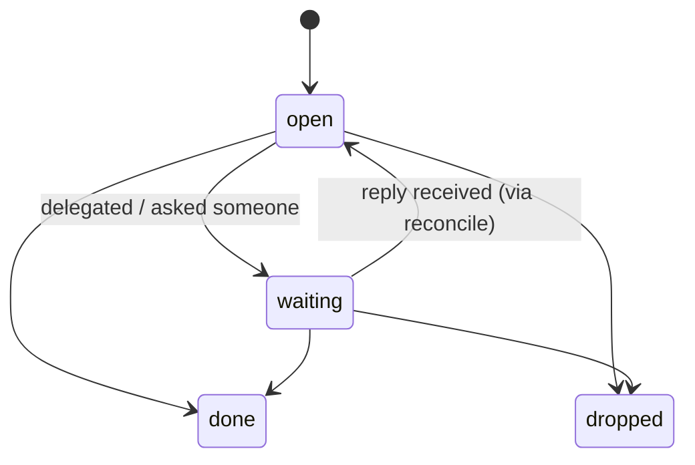
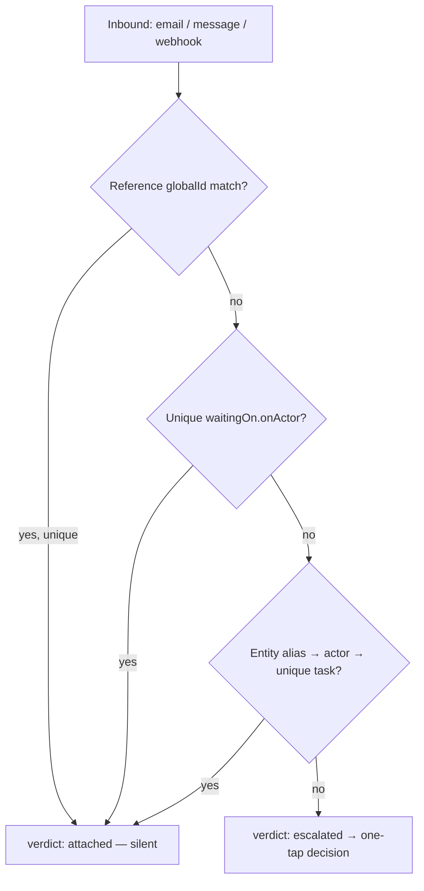

# HIP — the agent↔human interaction protocol (schema v0.1)

A small protocol for the things agents and humans owe each other: tasks that outlive a
session, decisions that need one tap, follow-ups on what you're waiting for, and
inbound messages that need to find their place. Local-first, markdown-and-SQLite,
fully conformant on one human's laptop.

This is the spec read over coffee. The exact wire mapping lives in
[`binding.md`](./binding.md).

## The shape of the problem

Three running examples carry the whole spec:

- **The suitcase.** "Unpack the suitcase from the New York trip." No due date, no one
  else involved — but it still has to get done. A plain task.
- **The laundry.** The dryer finishes; you're home until 6. "Fold now, after dinner, or
  tomorrow morning?" One tap. A decision, surfaced from an external status change.
- **Dinner with Alex.** You texted Alex Tuesday about Saturday; no reply. Three days
  later: "Still waiting on Alex — follow up?" A nudge. Then Alex replies "Saturday
  works!" and the task quietly becomes actionable again. A reconcile.

## The five primitives

"Five primitives" is the pitch, not the type system. Precisely: **Task** and
**Decision** are stored resources; **Nudge** is state on a task plus server timer
behavior; **Reconcile** is a flow with a result type; **Status** is an event shape.
Supporting them: Actor, Reference, Entity, Execution, Event.

### 1. Task — a unit of work owed to or by a human

Outlives any agent session. Distinct from an A2A/MCP "task" (an agent's ephemeral work
session — see the two-state-machines rule).

```jsonc
{
  "id": "tsk_...",
  "title": "Unpack suitcase from the New York trip",
  "status": "open | waiting | done | dropped",
  "delegatedBy": { "actor": "act_...", "role": "creator | delegator" },  // REQUIRED provenance
  "waitingOn": Waiting | null,          // present iff status == "waiting"
  "references": [ Reference ],        // where truth lives outside HIP
  "thread": [ { "actor", "content", "at" } ],  // the shared substrate humans + agents both write to
  "description": "...",               // markdown
  "_meta": {}
}
```



**Orient-first.** Reading a task returns everything an agent needs to start in one
call — title, status, provenance, full thread, references, prior executions. No
side-channel context. (Proven by Hermes Kanban's `kanban_show()`-first worker loop.)

**Thread vs. event history.** `thread` is conversation (what humans and agents say
about the task, and where reconcile appends inbound messages). The **Event** log is
state changes. Both append-only; never conflated.

**One verb per transition.** Content edits never change status. `task_update` rejects
`status`/`waiting`; transitions go through `task_wait`, `task_done`, `task_drop`. One
write path per transition keeps the event log unambiguous.

### 2. Decision — one question, answerable in one tap

```jsonc
{
  "id": "dec_...",
  "task": "tsk_..." | null,           // standalone questions are allowed
  "prompt": "Dryer's done and you're home until 6.",
  "options": [ { "id": "now", "label": "Fold now" }, { "id": "dinner", "label": "After dinner" } ],
  "allowFreeText": true,              // the escape hatch — default true
  "expiresAt": null,                  // unanswered → resolves as kind:"expired", never silent deletion
  "snoozedUntil": null,               // Dispatcher "not now" — NOT a resolution
  "resolution": { "kind": "option | freeText | dismissed | expired", "optionId", "freeText", "at" } | null
}
```

Every decision supports four universal affordances beyond its options: **free text**
(always), **snooze** (non-terminal — delays re-delivery), **dismiss** (terminal), and
**expiry** (resolves as an `expired` event — the learning substrate keeps it). Chat
escalation is in the schema but deferred in v0.1.

**`block` is the agent's word for it.** Agent frameworks call this primitive "block"
(`kanban_block(reason)`). The binding exposes `task_block(taskId, executionId, reason)`:
it files a decision and links the calling **Execution**, which pauses in
`input-required`. Resolving the decision resumes it. Humans see a decision; agents say
block. Same object, two vocabularies.

### 3. Nudge — the GTD waiting-for triple, agent-addressable

Lives on the task as `waitingOn`; surfaces as a decision when cadence fires.

```jsonc
{
  "onActor": "act_alex",              // who we're waiting on
  "since": "2026-06-09",
  "via": "ref_imessage_thread_1",     // Reference — where the ask lives
  "cadence": "P3D",                   // ISO-8601 duration; null = never auto-nudge
  "lastNudge": "2026-06-12"
}
```

**The server owns the timer.** When `cadence` elapses, the server files a decision
("3 days since you texted Alex — follow up?"), not an automatic action — human in the
loop by default. "Server" is a *role*, not a deployment: a hosted service or the local
daemon both qualify. The guarantee is **at or after** cadence elapse — late is fine,
lost is not. A nudge that fires when the machine wakes is conformant; real-time
delivery is a quality-of-implementation concern.

### 4. Reconcile — map inbound context to a task

Not a stored object — a flow with a defined input and result.

```jsonc
// InboundEnvelope — what reconcile receives
{ "id": "env_...",            // idempotency key — same envelope twice = one reconcile
  "kind": "email | message | webhook",
  "from": "act_alex" | "+1555...",   // resolved Actor, or raw address
  "content": "Saturday works!",      // the body — UNTRUSTED
  "reference": Reference }

// ReconcileResult
{ "input": "env_...", "verdict": "attached | created | escalated",
  "task": "tsk_...", "decision": "dec_..." | null }
```



The reference implementation's verdict is **deterministic tiers** — reference
`globalId`, then unique `waitingOn.onActor`, then entity alias — with no LLM in the
daemon. Anything ambiguous escalates a one-tap decision; `created` happens only via
that decision, keeping the human in the loop. *Alex texts "Saturday works!" → matches
the dinner task's iMessage reference → attaches, status flips `waiting → open`. No
notification needed beyond the text itself.*

**Untrusted input.** Envelope `content` is appended to the thread as data and **never**
executed as instructions. This is a protocol constraint, not an implementation choice.

### 5. Status — sync truth with where it lives

```jsonc
// StatusUpdate (event)
{ "task": "tsk_fold_laundry", "reference": "ref_smart_dryer",
  "observed": { "remoteStatus": "cycle-complete", "at": "..." },
  "effect": { "status": "open" } | null }
```

The dryer reports done → the fold-laundry task becomes actionable → a decision surfaces.
Pull-vs-push mechanics are transport-layer; the spec fixes only the event shape.

## The two-state-machines rule

This is the rule to remember. There are **two** state machines, and they never merge:

- **Task status** is the *human-level* state: open / waiting / done / dropped.
- **Execution status** is the *agent-side* state: an A2A work session
  (submitted / working / input-required / completed / failed / canceled).

A task can have zero or many executions. The bridge between the machines is
**behavioral, not structural**: a blocked execution *files a decision*; a missed
heartbeat *feeds the nudge engine*. Execution status never leaks into task status. An
agent crashing does not mark Matt's task done; Matt finishing a task does not cancel an
agent's session.

```jsonc
// Execution — the agent work session
{ "id": "exe_...", "task": "tsk_...", "actor": "act_agent",
  "status": "submitted | working | input-required | completed | failed | canceled",
  "blockedOn": "dec_..." | null,     // present iff input-required; resolving it resumes
  "lastHeartbeatAt": "...", "expectedNextHeartbeatAt": "..." }
```

Heartbeats let the nudge engine tell *working* from *silently failed*: a missed
heartbeat can file a decision ("the research agent went quiet — retry / reassign /
drop?") exactly like an elapsed waiting-on-human cadence. One follow-up mechanism, two
kinds of unreliable actor.

## Supporting objects

```jsonc
// Actor — any addressable identity
{ "id": "act_...", "kind": "person | agent | service | group", "displayName": "Alex", "address": "+1555..." }

// Reference — a typed link to where truth lives (shape after Microsoft To Do's linkedResource + Jira globalId)
{ "id": "ref_...", "type": "email-thread | ticket | url", "globalId": "imessage:thread_abc",  // upsert idempotency
  "role": "source | check-for-updates | publish-updates-to" }

// Entity — a thin context node that makes reconcile cheap
{ "id": "ent_...", "kind": "person | vendor | place | initiative", "aliases": ["Alex", "Alex R."], "context": "..." }

// Event — append-only history
{ "id": "evt_...", "task": "tsk_..." | null, "decision": "dec_..." | null,
  "actor": "act_...", "kind": "created | status-changed | decision-resolved | nudge-fired | reconciled | steered", "at": "..." }
```

Every object carries `id`, `createdAt`, `updatedAt`. Unknown fields **MUST** be
preserved on rewrite (the Taskwarrior rule), and `_meta` is the extension escape hatch
everywhere — so a richer client never forces a migration.

## Where HIP sits (related work, by layer)

HIP is not "nobody did agent↔human." It composes existing layers:

- **Agent UI / streaming** — AG-UI and similar handle how an agent's work renders live.
  HIP is orthogonal: it's the *durable* state, not the live stream.
- **Agent runtimes** — Hermes/OpenClaw, A2A, MCP Tasks own the *execution* state machine.
  HIP references them via Execution; it does not replace them.
- **Human-addressing layers** — HAP / HAIP / A2H explore agent→human messaging. HIP's
  contribution is the *waiting/decision/reconcile* triple as first-class, agent-callable
  primitives over a human's real task list.

Storage and operational prior art: Basic Memory (markdown truth + SQLite index, with
`doctor`/`reindex`); Taskwarrior (preserve unknown fields); Jira (`globalId` upsert
idempotency); Quartz misfire handling (fire-once-on-wake timers).

## Deliberately out of v0.1

Recurrence, subtasks/dependencies, multi-user permissions, sync/federation, priority
scoring beyond an optional `low|normal|high` field, skill learning from decision
history, capability profiles. Two forward-compat seeds exist so multi-store futures
don't force a migration: optional `workspaceId` on every object and `origin` on
imported records. Nothing reads them in v0.1.

## Deployment stance

**Local-first.** The reference implementation is a local daemon over a folder of
markdown + SQLite — one human, one folder, no cloud, fully conformant. Your attention
data lives on your machine by default. The spec is deployment-agnostic, so hosted
implementations are equally conformant; they're simply not required for the protocol to
be useful.
